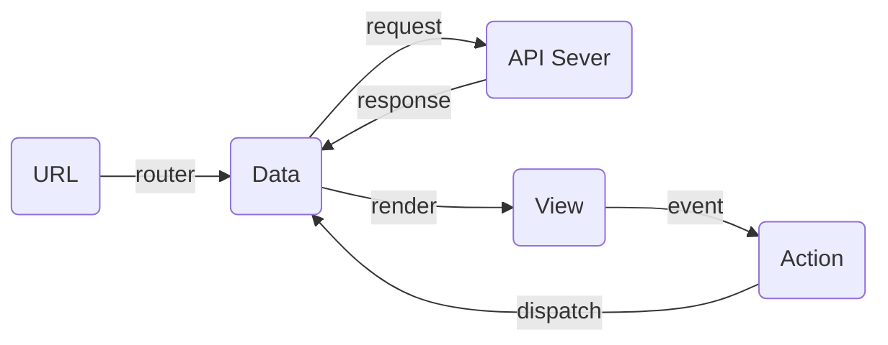

# 前端概念图

## 图示

## 概念

|    概念    |        说明        |
| ---------- | ------------------ |
| URL        | 访问什么页面       |
| Data       | 显示什么信息       |
| View       | 页面长成什么样     |
| Action     | 对页面做了什么操作 |
| API Server | Data数据的来源     |

## 参考

<https://github.com/sorrycc/blog/issues/1>

> 方跃明
> 2020-02-07
