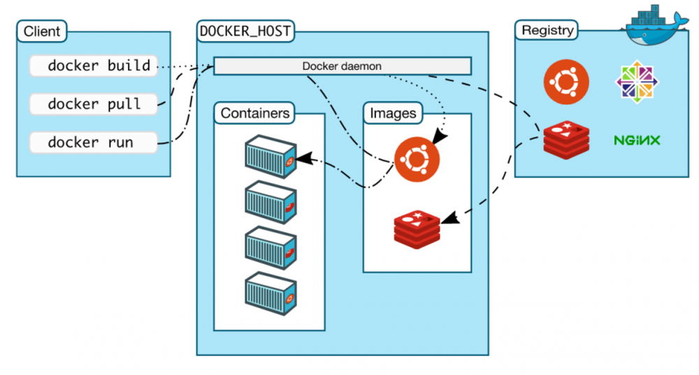
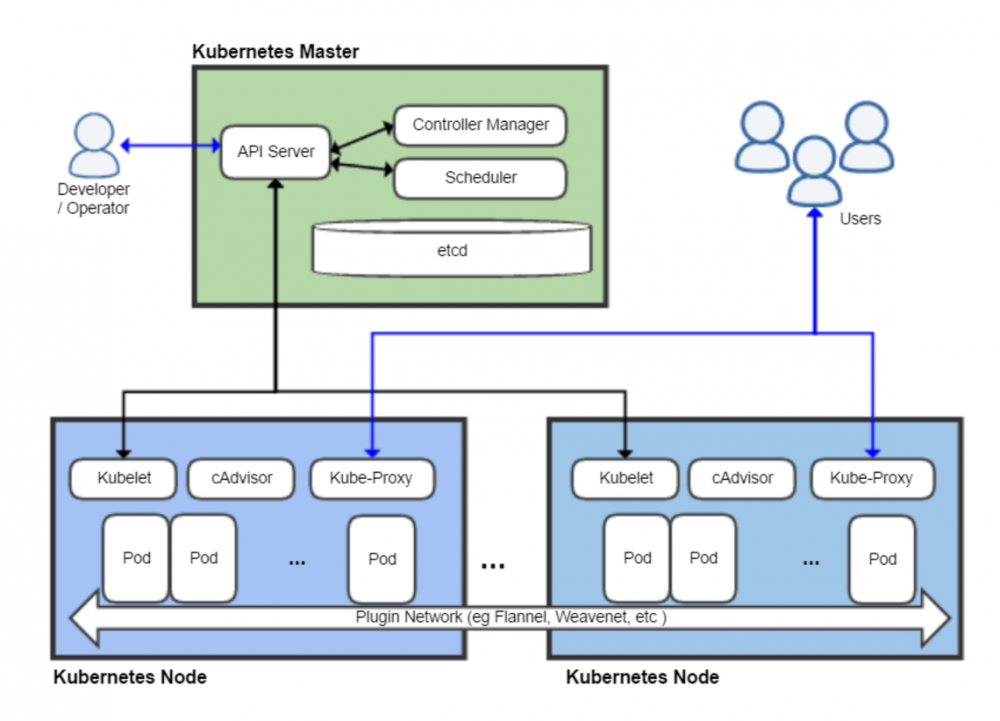
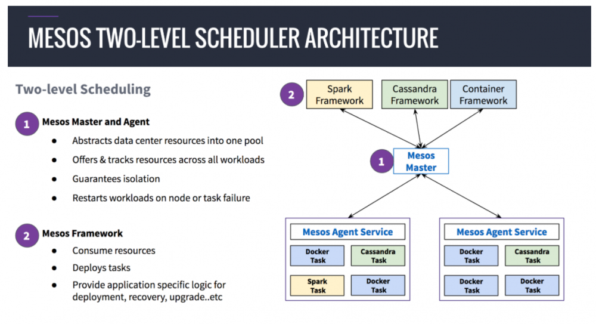

# Docker、kubernetes和Apache Mesos之间的正确关系

<http://www.techug.com/post/docker-vs-kubernetes-vs-apache-mesos.html>

无数的文章、社交媒体在探讨Docker、kubernetes、Mesos三者之间孰优孰劣。如果你听信了某些一知半解者的言论，你可能会认为这三个开源项目正在为争夺容器霸权而殊死战斗。同时，你也会相信，在这三者间的选择无异于对其所奉宗教的信仰，而且真正的信徒敢于大胆和异教徒作斗争，并且拥护自己的信仰。

那些都是扯淡。

虽然这三种技术都可以使用容器来部署、管理和扩展应用程序，但实际上它们每个都侧重解决不同的问题，并且扎根非常不同的环境之上。事实上，这三种被广泛采用的工具链彼此完全不同。

与其比较这些快速演进的技术的重叠特性，不如让我们回顾一下每个项目的原始任务、架构以及它们之间如何相互补充和交互。

## Docker

今天的Docker公司脱胎于一个平台即服务的初创公司dotCloud。dotCloud团队发现，在许多应用程序和客户之间管理依赖关系和二进制文件需要做大量的工作。因此，他们将Linux cgroups和namespaces的一些功能组合成一个简单易用的包，这样应用程序就可以在任何基础设施上持续运行。这个包就是Docker镜像，它提供以下功能:

1. 将应用程序和库封装在单个包中(Docker镜像)，因此应用程序可以跨多环境一致部署;
提供类似于git的语义，例如“dockerpush”，“docker commit”，这样可以让应用程序开发人员可以轻松地采用新技术，并将其融入到现有的workflow中;

2. 将Docker镜像定义为不可变层，启用不可变的基础设施。提交的更改被存储为一个单独的只读层，这让镜像复用和跟踪更改变得更加容易。另外，层还可以通过传输更新而不是整个镜像来节省磁盘空间和网络流量;

3. 通过使用可以临时存储运行时更改的可写层来实例化不可变映像，从而方便快速部署和扩展应用程序的多个实例。

4. 随着Docker的风靡，开发人员开始从笔记本电脑转移到在生产环境中运行。这就需要借助工具来协调这些容器，我们称为容器编排。有趣的是，Apache Mesos的Marathon成为当时(2014年6月)第一个支持Docker镜像的容器编排工具(我们将在下面详细描述它)。就连Docker创始人、首席技术官Solomon Hykes也推荐Mesos为“生产集群的黄金标准”。不久之后，除了Marathon之外，许多容器编排技术出现了，这其中包括：Nomad、kubernetes、DockerSwarm(现在是Docker引擎的一部分)。

随着Docker开始商业化开源文件格式，该公司也开始引入工具来补充核心Docker文件格式和runtime引擎，包括:

* Docker hub
* Docker registry
* Docker cloud
* Docker datacenter

​Docker让开发者可以打包他们的应用以及依赖包到一个可移植的容器中的特性，使其成为软件行业的游戏规则改变者;这有点类似mp3格式帮助重塑了音乐产业。Docker文件格式成为行业标准，并且领导容器技术供应商(包括Docker、Pivotal, Mesosphere以及其他许多)成立CNCF和OCI。今天，CNCF和OCI的目标就是确保跨容器技术的互操作性和标准化接口，并确保使用任何工具构建的Docker容器，都可以在任何runtime或基础设施上运行。

## kubernetes

谷歌很早就认识到Docker镜像的潜力，并试图在谷歌云平台上交付“容器编排即服务”。谷歌在容器方面有丰富的经验(他们在Linux中引入了cgroups)，但是现有的内部容器和像Borg这样的分布式计算工具与它们的基础设施直接耦合。因此，谷歌没有使用现有系统中的任何代码，而是从头开始设计了kubernetes，以编排Docker容器。kubernetes于2015年2月发布，并提出以下目标和考虑:

1. 为应用程序开发人员提供一个强大的工具，用于Docker容器编排，而不必与底层基础设施交互;
2. 跨云环境下，为一致的应用程序部署经验和APIs 提供标准部署接口和原型;
3. 构建一个模块化的API核心，允许供应商围绕核心kubernetes技术集成系统。

截至2016年3月，谷歌向CNCF捐赠了kubernetes，至今谷歌仍是该项目的主要贡献者(其次是Redhat、CoreOS等)。

kubernetes对应用程序开发人员非常有吸引力，因为它减少了对基础设施和操作团队的依赖。供应商也非常喜欢kubernetes，因为它提供了一种简单的方式来让他们拥抱容器运动，并为他们运行自己的kubernetes部署提供一个商业化解决方案。kubernetes之所以很有吸引力，因为它是CNCF下的开源项目，与Docker集群相比，后者虽然是开源的，但却受到Docker Inc .的严格控制。

kubernetes的核心优势是为应用程序开发人员提供强大的工具来编排无状态的Docker容器。虽然有多个计划将项目的范围扩展到更多的工作负载(如分析和有状态的数据服务)，但这些计划仍然处于非常早期的阶段，还有待观察。

## Apache Mesos

Apache Mesos最初是UCBerkeley为创建下一代集群管理器而诞生的项目，并从如谷歌的Borg和Facebook的Tupperware中吸取经验教训。但是Borg和Tupperware是单体架构，并且是和物理基础设施绑定的封源专有技术。Mesos引入了模块化架构，采用开源的方法，且其设计完全独立于底层基础架构。基于这些因素，Mesos很快被Twitter、Apple(Siri)、Yelp、Uber、Netflix以及许多领先的科技公司所采用，以支持他们在微服务、大数据和实时分析到弹性伸缩的一切实践。

作为一个集群管理器，Mesos的架构是为了解决一组非常不同的挑战:

1. 将数据中心资源整合成一个单一的池，以简化资源配置，同时在私有或公共云之间提供一致的应用程序和操作体验;
2. 在相同的基础设施上使用不同的工作负载，比如分析、无状态微服务、分布式数据服务和传统应用程序，以提高利用率，降低成本和空间;
3. 特定应用程序的任务(如部署、自修复、扩展和升级)设置为自动化day-two 操作;提供高可用的容错基础设施;
4. 在不修改集群管理器或现有应用程序的情况下，提供常绿的可扩展性来运行新的应用程序和技术;
5. 将应用程序和底层基础设施弹性扩展到数万个节点。

Mesos的独特之处还在于，可以单独管理各种不同的工作负载——包括传统的应用程序，如Java、无状态Docker微服务、批处理作业、实时分析和有状态的分布式数据服务。Mesos广泛的工作负载覆盖来自于它的两级架构，它支持“应用感知”的调度。应用感知调度是通过将应用程序特定操作逻辑封装到“Mesos框架”(类似于运行中的runbook)来完成的。

Mesos Master资源管理器，提供这些底层基础设施的框架部分，同时保持隔离。这种方法允许每个工作负载有自己专用的应用程序调度器，它了解其对部署、缩放和升级的具体操作需求。应用程序调度程序也独立地被开发、管理和更新，这让Mesos保持高度可扩展性，支持新的工作负载，或者随着时间的推移增加更多的操作能力。

以一个团队如何管理升级为例。无状态应用程序可以从“蓝/绿”部署方法中获益;当旧的应用程序还在使用的时候，另一个完整版本的应用程序已经spun up，当旧的应用程序被销毁时，流量切换到新的应用程序。但是，升级像HDFS或Cassandra这样的数据工作负载需要一次脱机，维护本地数据量以避免数据丢失，执行特定序列的升级，并在升级之前和之后对每个节点类型执行特殊检查和命令。这些步骤中的所有环节针对特定的应用程序或服务，甚至是特定版本进行的。这使得用常规容器编排调度器管理数据服务变得非常困难。

Mesos具备按需管理每个工作负载的能力，使得许多公司将Mesos作为一个统一的平台，并通过其将微服务和数据服务结合运行。运行数据密集型应用程序的一个通用参考架构是“SMACK堆栈”。

## 清晰时刻

注意：我们在描述Apache Mesos的过程中，没有提及任何关于容器编排的内容。那么，为什么人们总是会将Mesos与容器编排联系起来呢？容器编排是一个可以在Mesos模块化架构上运行的工作负载的例子，它使用的是构建在Mesos上的一个专门的编排“框架”Marathon。Marathon最初是为了在cgroup容器中编排应用程序(如JARs、tarball、ZIP文件)而开发的，并且在2014年成为第一批支持Docker容器的容器编排之一。

因此，当人们拿Docker、kubernetes和Mesos比较时，他们实际上是在对比kubernetes、Docker Swarm和Mesos上运行的Marathon。

为什么这很重要？因为Mesos根本不关心上面跑的是什么。Mesos可以为Java应用服务器、Docker容器编排、Jenkins CI Jobs, Apache Spark analytics, Apache Kafka streaming以及更多的共享基础设施提供集群服务。Mesos甚至可以运行kubernetes或其他容器编排，尽管还没有对外集成。

Mesos的另一个考虑(以及为什么它对许多企业架构师有吸引力)是它在运行任务关键工作负载时的成熟度。Mesos已经在大规模生产环境下运行(数万台服务器)超过7年，这就是为什么它比市场上其他技术更成熟，更可靠的原因。

## 这一切意味着什么？

总之，这三种技术都与Docker容器有关，并允许您访问容器编排，以获得应用程序的可移植性和伸缩性。那么在这三者间要如何选择呢？这就要视不同的工作环境需求而定，工作需求不同，所适用的工具自然也是各不相同。如果您是一名应用程序开发人员，并且正在寻找一种现代的方法来构建和打包您的应用程序，或者加快微服务项目，那么Docker容器格式和开发工具是你最好的选择。

如果你是一个dev / devops团队,想要构建一个专门的docker容器编排系统,并愿意亲自动手让你的解决方案和底层基础设施集成(或依赖于公共云基础设施如谷歌引擎或Azure容器服务),kubernetes将是你一个很好的选项。

如果您想构建一个可靠的平台，用以运行多任务关键工作负载，包括Docker容器、遗留应用程序(例如Java)和分布式数据服务(例如Spark、Kafka、Cassandra、Elastic)，并希望所有这些都可以在云或数据中心上可移植，那么，Mesos是最适合你的。

无论你作何选择，你所拥抱的一系列工具都将提升你的服务器资源利用率，同时简化应用程序移植，并提高开发人员的敏捷性。你真的值得拥有！
