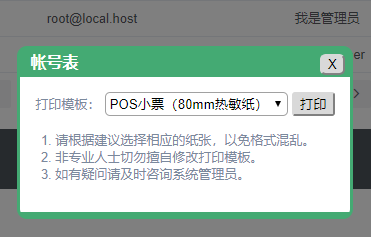
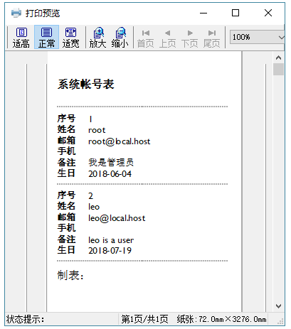
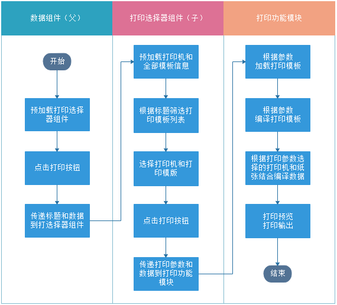
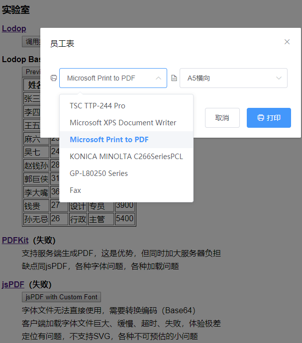
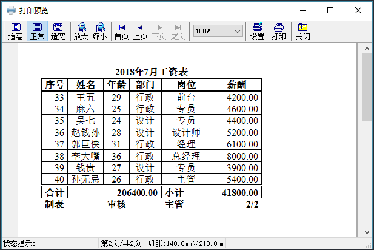

# Lodop打印解决方案

## 改进版

- 最新版本已改用`load-script`动态加载，不再本地集成，详见：[leo-lodop](https://axolo.github.io/leovue/api/leo-lodop.html)
- 不再从入口文件`index.html`加载全局`LODOP`脚本，改为下载后本地按需加载
- 不再杂糅到应用中，独立成打印组件，具体应用中以子组件方式调用
- 去除细枝末节，仅保留必备参数，可灵活配置
- `Vue.js`的精华之处就是要抽象并封装常用功能形成组件，供应用调用，而不是复制粘贴常用功能

### 组件（LeoLodop .vue）

```vue
<template>
  <div id="lodop">
    <leo-dialog :title="title" :visible="visible" @close='close'>
      <span class="label">打印模板：</span>
      <select v-model="templateId" placeholder="请选择打印模板">
        <option
          v-for="item in templates"
          :key="item.id"
          :value="item.id">
          {{item.name}}（{{item.bio}}）
        </option>
      </select>
      <button @click="print" title="打印">打印</button>
      <div class="tips">
        <ol>
          <li>请根据建议选择相应的纸张，以免格式混乱。</li>
          <li>非专业人士切勿擅自修改打印模板。</li>
          <li>如有疑问请及时咨询系统管理员。</li>
        </ol>
      </div>
    </leo-dialog>
  </div>
</template>

<script>
import _ from 'lodash'
import './leo-lodop/CLodopfuncs'
import LeoDialog from './LeoDialog'
export default {
  components: { LeoDialog },
  props: [
    'title',            // 标题
    'data',             // 数据
    'templates',        // 模版集
    'visible'           // 是否可见
  ],
  data() {
    return {
      lodop: LODOP,     // 本地LODOP
      templateId: ''    // 选中模版id
    }
  },
  mounted() {
    const defaultTemplate = _.find(this.templates, { default: true })
    defaultTemplate && (this.templateId = defaultTemplate.id)   // 默认模板
  },
  methods: {
    close() {
      this.$emit('update:visible', false)
    },
    print() {
      const template = _.find(this.templates, {id: this.templateId})
      const axios = require('axios')
      let doc = ''
      axios.get(template.url).then(res => {
        // 多模板引擎支持，默认为doT.js
        switch(template.engine) {
          default:
            const doT = require('dot')
            doc = doT.template(res.data)(this.data)
            break
        }
        this.lodop.PRINT_INIT(this.title)
        // 多格式支持，默认为TABEL格式
        switch(template.format) {
          default:
            this.lodop.ADD_PRINT_TABLE(
              template.params.top,
              template.params.left,
              template.params.right,
              template.params.bottom,
              doc)
            break
          case 'HTM':
          case 'HTML':
            this.lodop.ADD_PRINT_HTM(
              template.params.top,
              template.params.left,
              template.params.right,
              template.params.bottom,
              doc)
            break
        }
        this.lodop.PREVIEW()
      }).catch(err => {
        this.$message(err)
      })
      this.close()
    }
  }
}
</script>

<style scoped>
/* 略 */
</style>
```

### 模板（accounts-80mm.html）

```html
<!-- doT.js Template -->
<style>
  * { font-family: 'Gill Sans', 'Gill Sans MT', Calibri, 'Trebuchet MS', sans-serif; }
  .label { font-weight: bold; }
  .label:after { content: '：'; }
  .main { font-size: small; margin-bottom: 10; }
  h4 { margin: 5 0; }
  hr { border: 1px dashed darkgray; }
</style>
<h4>系统帐号表</h4>
<hr>
<div class="main">{{~it:v:i}}
  <div>
    <span class="label">序号</span>
    <span claass="content">{{=i+1}}</span>
  </div>
  <div>
    <span class="label">姓名</span>
    <span claass="content">{{=v.name}}</span>
  </div>
  <div>
    <span class="label">邮箱</span>
    <span claass="content">{{=v.mail}}</span>
  </div>
  <div>
    <span class="label">手机</span>
    <span claass="content">{{=v.mobile?v.mobile:''}}</span>
  </div>
  <div>
    <span class="label">备注</span>
    <span claass="content">{{=v.bio?v.bio:''}}</span>
  </div>
  <div>
    <span class="label">生日</span>
    <span claass="content">{{=moment(v.created).format('YYYY-MM-DD')}}</span>
  </div>
  <hr>{{~}}
</div>
<div>制表：</div>
```

### 打印对话框（含leo-dialog子组件）



### 打印预览（80mm小票模板）



## 初始版

WEB打印是BS架构开发的一个痛点，一般解决方案都是输出PDF格式，然后调用浏览器打印功能。
如果不借助后台，纯浏览器输出，目前的PDF解决方案，光浏览器端加载字体（特别是CJK字体）这一点就能让开发者痛不欲生。
如果借助后台，服务器计算、生成文件和传输文件的压力陡然增大。

努力尝试用[jsPDF](https://github.com/MrRio/jsPDF)和[PDFKit](http://pdfkit.org/)来解决，对于稍微复杂一点的打印设计都难以实现，简直让人抓狂，放弃。

尝试[Lodop](http://www.lodop.net/)打印方案，基本上可以满足复杂需求，可惜只有Windows服务端（客户端基本不受操作系统影响，有浏览器就可以），而且需要注册，而且没有详细的API文档。
不过，功能之强大，这些已无伤大雅。摸爬滚打写了两天，终于构建出了一个雏形。

### 技术栈

- [Lodop](http://www.lodop.net/)：打印功能（已自行封装成模块）
- [axios](https://github.com/axios/axios)：异步加载打印模板
- [doT.js](https://github.com/olado/doT)：打印模板编译
- [Vue.js](https://cn.vuejs.org/)：打印数据页组件（父组件）、打印选择器组件（子组件）
- [Lodash](https://github.com/lodash/lodash)：数据查询和筛选
- [Element-UI](http://element-cn.eleme.io)：UI框架

### Lodop模块（硬编码，非常粗放！）

```js
module.exports = {
  getPrinters() {
    return LODOP.Printers
  },
  preview(params) {
    const axios = require('axios')
    const template = params.template
    axios.get(template.file).then(res => {
      const doT = require('dot')
      const table = doT.template(res.data)(params.data)
      LODOP.PRINT_INIT(params.title)
      LODOP.SET_PRINTER_INDEXA(params.printer)
      // 不用严格指定纸张和方向，系统会记忆上次选择
      // LODOP.SET_PRINT_PAGESIZE(template.orient, 0, 0, template.page)
      LODOP.ADD_PRINT_TABLE('10mm', '10mm', 'RightMargin:10mm', 'BottomMargin:10mm', table)
      LODOP.PREVIEW()
    }).catch(err => console.log(err))
  }
}
```

### 流程图



### 模板选择器



### 打印预览


