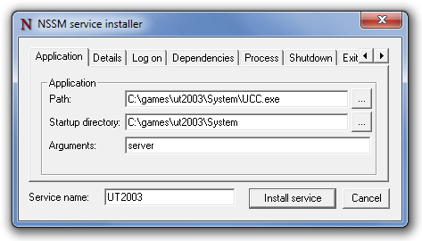

# Node.js后台运行及桌面应用

## 应用打包

- [Electron](https://github.com/electron/electron)
- [NW.js](https://github.com/nwjs/nw.js)
- [Vuido](https://github.com/mimecorg/vuido)
- [nexe](https://github.com/nexe/nexe)

## 后台运行

- Linux下可以使用[forever](https://github.com/foreverjs/forever)
- Windows服务使用[NSSM](https://nssm.cc/usage)
- Corey Butler 后台系列
  - [node-windows](https://github.com/coreybutler/node-windows)
  - [node-linux](https://github.com/coreybutler/node-linux)
  - [node-mac](https://github.com/coreybutler/node-mac)

