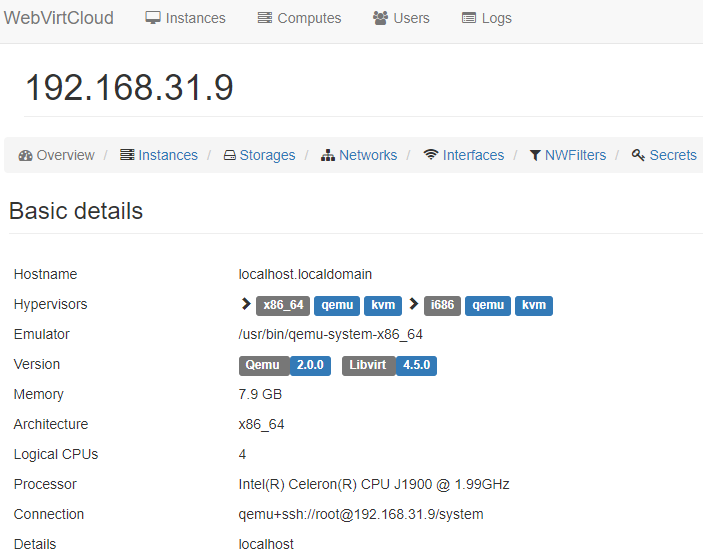
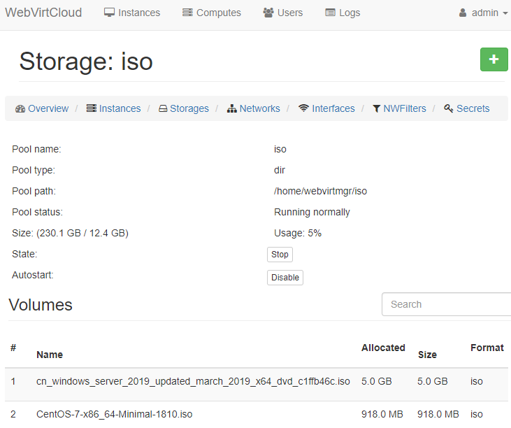
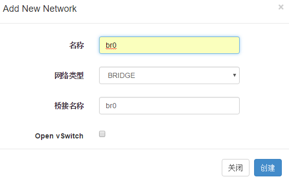
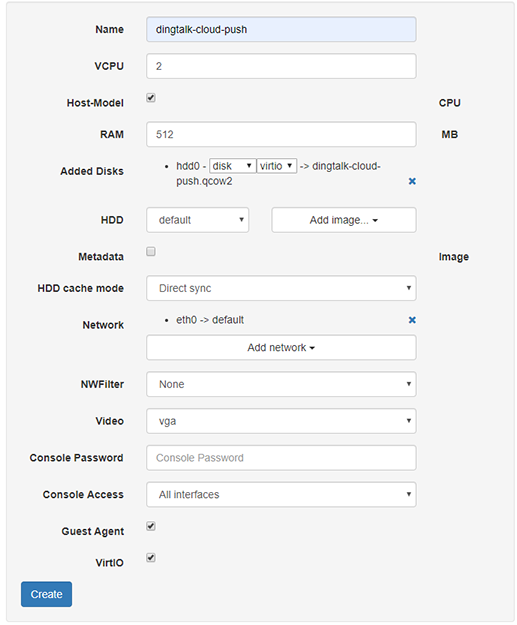
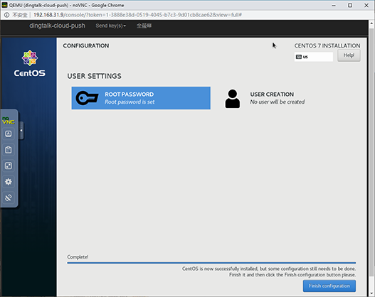

# WebVirtCloud部署笔记

## 系统配置

### SELinux

允许`WebVirtCloud`通行

```bash
sudo semanage fcontext -a -t httpd_sys_content_t "/srv/webvirtcloud(/.*)"
```

或关闭`SELINUX`

```bash
vi /etc/selinux/config
```

```ini
SELINUX=disabled
```

### 防火墙

允许`nginx`和`novnc`通行。

```bash
firewall-cmd --zone=public --add-port=80/tcp --permanent      # nginx
firewall-cmd --zone=public --add-port=6080/tcp --permanent    # novnc
firewall-cmd --reload
```

## 安装KVM

### 虚拟化支持

执行以下命令，若有高亮`vmx`或`svm`输出表示硬件支持虚拟化。

```bash
egrep '(vmx|svm)' --color=always /proc/cpuinfo
```

### 设置网桥

网桥相当于外网和虚拟机之间的交换机。

```text
             +-----------+     +----------+     +----------+
Internet --- | HOST eth0 | --- | HOST br0 | --- | VMs eth0 | --- VMs
             +-----------+     +----------+     +----------+
```

```bash
cp /etc/sysconfig/network-scripts/ifcfg-enp2s0 /etc/sysconfig/network-scripts/ifcfg-br0
```

```ini
TYPE=Bridge                                   # 类型为网桥
PROXY_METHOD=none
BROWSER_ONLY=no
BOOTPROTO=dhcp                                # MAC未绑定IP时建议配置静态IP
DEFROUTE=yes
IPV4_FAILURE_FATAL=no
IPV6INIT=yes
IPV6_AUTOCONF=yes
IPV6_DEFROUTE=yes
IPV6_FAILURE_FATAL=no
IPV6_ADDR_GEN_MODE=stable-privacy
NAME=br0                                      # 名称
# UUID=87cd35a1-1421-4066-a7bc-9d8ba4e727d5   # 注释掉
DEVICE=br0                                    # 设备
ONBOOT=yes
ZONE=public
```

```bash
vi /etc/sysconfig/network-scripts/ifcfg-enp2s0
```

```ini
BRIDGE=br0
TYPE=Ethernet
PROXY_METHOD=none
BROWSER_ONLY=no
BOOTPROTO=dhcp
DEFROUTE=yes
IPV4_FAILURE_FATAL=no
IPV6INIT=yes
IPV6_AUTOCONF=yes
IPV6_DEFROUTE=yes
IPV6_FAILURE_FATAL=no
IPV6_ADDR_GEN_MODE=stable-privacy
NAME=enp2s0
UUID=87cd35a1-1421-4066-a7bc-9d8ba4e727d5
DEVICE=enp2s0
ONBOOT=yes
ZONE=public
```

```bash
systemctl restart network
brctl show
```

### 安装KVM依赖

```bash
yum install kvm qemu-kvm qemu-kvm-tools libvirt libvirt-python libvirt-client
yum install virt-install python-virtinst bridge-utils libguestfs-tools
```

|       名称       | 必须 |               说明               |
| ---------------- | ---- | -------------------------------- |
| kvm              | 是   | KVM核心，KVM虚拟机模块           |
| qemu-kvm         | 是   | QEMU模拟器，QEMU KVM虚拟化模拟器 |
| qemu-kvm-tools   | 是   | QEMU工具，QEMU工具               |
| libvirt          | 是   | 虚拟化API，虚拟化平台的开源的API |
| libvirt-python   | 是   | libvirt Python语言支持           |
| libvirt-client   |      | libvirt 客户端                   |
| virt-install     |      | 虚拟机安装工具                   |
| python-virtinst  |      | 虚拟机安装工具Python语言支持     |
| brige-utils      |      | 网桥管理工具                     |
| libguestfs-tools |      | 虚拟机镜像管理工具               |
| virt-manager     |      | 虚拟机管理工具，需要GUI          |
| virt-viewer      |      | 虚拟机查看工具，需要GUI          |
| virt-v2v         |      | 虚拟机镜像转换工具               |

### 设置服务

```bash
systemctl enable libvirtd   # 设置服务自启动
systemctl start libvirtd    # 启动服务
```

## 安装WebVirtCloud

参见：<https://github.com/retspen/webvirtcloud>

### 更新 hypervisor gstfsd

```bash
wget -O - https://clck.ru/9VMRH | sudo tee -a /usr/local/bin/gstfsd
sudo service supervisor restart
```

### 获取SECRET_KEY

```bash
vi /srv/webvirtcloud/webvirtcloud/settings.py
```

```python
import random, string
haystack = string.ascii_letters + string.digits + string.punctuation
print(''.join([random.SystemRandom().choice(haystack) for _ in range(50)]))
```

### 安装WebVirtCloud控制台

#### 安装WebVirtCloud依赖

```bash
yum install python-virtualenv python-devel libvirt-devel
yum install glibc gcc nginx supervisor python-lxml git python-libguestfs
```

#### 克隆仓库

```bash
sudo mkdir /srv && cd /srv
sudo git clone https://github.com/retspen/webvirtcloud && cd webvirtcloud
cp webvirtcloud/settings.py.template webvirtcloud/settings.py
# now put secret key to webvirtcloud/settings.py
```

#### 开始安装WebVirtCloud

```bash
sudo virtualenv venv
sudo source venv/bin/activate
sudo venv/bin/pip install -r conf/requirements.txt
sudo cp conf/nginx/webvirtcloud.conf /etc/nginx/conf.d/
sudo venv/bin/python manage.py migrate
```

#### 配置supervisor

```bash
vi /etc/supervisord.conf
```

```ini
# 把以下内容添加到 [include] 段的 `files = ...` 之后
[program:webvirtcloud]
command=/srv/webvirtcloud/venv/bin/gunicorn webvirtcloud.wsgi:application -c /srv/webvirtcloud/gunicorn.conf.py
directory=/srv/webvirtcloud
user=nginx
autostart=true
autorestart=true
redirect_stderr=true
[program:novncd]
command=/srv/webvirtcloud/venv/bin/python /srv/webvirtcloud/console/novncd
directory=/srv/webvirtcloud
user=nginx
autostart=true
autorestart=true
redirect_stderr=true
```

#### 配置nginx

注释`nginx`原有`server`段相关配置

```bash
vi /etc/nginx/nginx.conf
```

```nginx
#    server {
#        listen       80 default_server;
#        listen       [::]:80 default_server;
#        server_name  _;
#        root         /usr/share/nginx/html;
#
#        # Load configuration files for the default server block.
#        include /etc/nginx/default.d/*.conf;
#
#        location / {
#        }
#
#        error_page 404 /404.html;
#            location = /40x.html {
#        }
#
#        error_page 500 502 503 504 /50x.html;
#            location = /50x.html {
#        }
#    }
}
```

确保webvirtcloud.conf配置正确

```bash
cat /etc/nginx/conf.d/webvirtcloud.conf
```

```nginx
upstream gunicorn_server {
    #server unix:/srv/webvirtcloud/venv/wvcloud.socket fail_timeout=0;
    server 127.0.0.1:8000 fail_timeout=0;
}
server {
    listen 80;

    server_name servername.domain.com;
    access_log /var/log/nginx/webvirtcloud-access_log;

    location /static/ {
        root /srv/webvirtcloud;
        expires max;
    }

    location / {
        proxy_pass http://gunicorn_server;
        proxy_set_header X-Real-IP $remote_addr;
        proxy_set_header X-Forwarded-for $proxy_add_x_forwarded_for;
        proxy_set_header Host $host:$server_port;
        proxy_set_header X-Forwarded-Proto $remote_addr;
        proxy_connect_timeout 600;
        proxy_read_timeout 600;
        proxy_send_timeout 600;
        client_max_body_size 1024M;
    }
}
```

### 用户和组设置

```bash
useradd webvirtmgr
usermod -G kvm -a webvirtmgr
```

### 启动服务

```bash
systemctl restart nginx
systemctl restart supervisord
```

```bash
supervisorctl status
```

```text
gstfsd             RUNNING   pid 24662, uptime 6:01:40
novncd             RUNNING   pid 24661, uptime 6:01:40
webvirtcloud       RUNNING   pid 24660, uptime 6:01:40
```

### 添加SSH KEY

用于控制台添加基础架构

```bash
su -s /bin/bash nginx
ssh-keygen
ssh-copy-id root@serverip
you need to accept add key
exit
```

## 控制台

### 进入控制台

```bash
open http://serverip
# username: admin
# password: admin
```

### 基础架构



### 存储池

```bash
chmod 755 -R /home/webvirtmgr
```

```text
/home/webvirtmgr
|-- images          # 磁盘镜像
`-- iso             # 光盘镜像
```



### 网络



### 实例



### 会话


