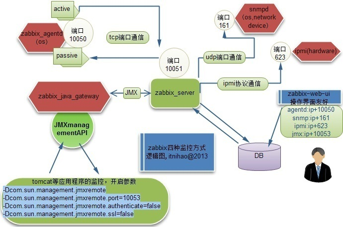

# Zabbix安装笔记

详细安装步骤参见：[官方安装手册](https://www.zabbix.com/documentation/3.0/manual/installation/install_from_packages)

## Zabbix Server



### 安装数据库

```bash
# 安装 MariaDB 服务器和客户端
yum install mariadb-server mariadb
systemctl start mariadb
mysql -uroot -ppassword    # 进入MySQL命令行
```

```sql
-- MariaDB新建zabbix用户
UPDATE user SET password=PASSWORD('zabbix') WHERE user='zabbix';
CREATE DATABASE IF NOT EXISTS zabbix DEFAULT CHARACTER SET utf8 COLLATE utf8_general_ci;
FLUSH PRIVILEGES;
QUIT
```

### 安装服务端

```bash
rpm -ivh http://repo.zabbix.com/zabbix/3.0/rhel/7/x86_64/zabbix-release-3.0-1.el7.noarch.rpm
yum install zabbix-server-mysql zabbix-web-mysql
cd /usr/share/doc/zabbix-server-mysql-3.0.3
zcat create.sql.gz | mysql -uzabbix -pzabbix zabbix
```

### 修改服务器配置

```ini
## vi /etc/zabbix/zabbix_server.conf
DBHost=localhost
DBName=zabbix
DBUser=zabbix
DBPassword=zabbix
```

### 修改WEB服务器配置文件

```ini
## vi /etc/httpd/conf.d/zabbix.conf
php_value data.timezone Asia/Shanghai
```

### 启动Zabbix服务器和WEB服务器

```bash
systemctl start zabbix-server
systemctl start httpd
```

## Zabbix Agent


### CentOS

#### 安装

```bash
yum install zabbix-agent
```

#### 配置

```ini
# vi /etc/zabbix/zabbix_agent.conf
LogFile=/var/log/zabbix/zabbix_agentd.log   # 日志
Server=127.0.0.1                            # Zabbix Server（直接连接）或者Zabbix Proxy（通过Proxy）
Hostname=Zabbix Server                      # 对应zabbix web里面的host，不一定是os本机名称
ServerActive=127.0.0.1                      # Zabbix Server或Zabbix Proxy
```

#### 配置防火墙，打开Zabbix Agent端口（默认入站端口10050）

```bash
systemctl start zabbix-agent
```

### Windows

#### 下载并解压到运行目录

[Zabbix pre-compiled agents for Windows](http://www.zabbix.com/download.php)

#### 配置conf(conf\zabbix-agentd.win.conf)

```ini
LogFile=c:\zabbix_agentd.log  # 日志
Server=127.0.0.1              # Zabbix服务器
Hostname=Windows Host         # 对应zabbix web里面的host，不一定是本机名称
ServerActive=127.0.0.1        # Zabbix服务器
```

- 注册为Windows服务：`bin\zabbix_agentd.exe -c \conf\zabbix_agentd.win.conf –i`
- 打开Zabbix Agent端口（默认入站端口10050）
- 从Windows服务启动Zabbix Agent客户端

## Zabbix Proxy

### 安装服务器

```bash
rpm -ivh http://repo.zabbix.com/zabbix/3.0/rhel/7/x86_64/zabbix-release-3.0-1.el7.noarch.rpm
yum install mariadb-server mariadb zabbix-proxy-mysql
systemctl start mariadb
mysql                       # 进入MySQL命令行
```

### 分配帐号、授权及建立数据库

```sql
UPDATE user SET password=PASSWORD('zabbix') WHERE user='zabbix';
FLUSH PRIVILEGES;
CREATE DATABASE IF NOT EXISTS zabbix_proxy DEFAULT CHARACTER SET utf8 COLLATE utf8_general_ci;
QUIT
```

### 导入数据库

```bash
# cd /usr/share/doc/zabbix-proxy-mysql-3.0.3
zcat schema.sql.gz | mysql -uzabbix -pzabbix zabbix_proxy
```

### 修改服务器配置文件

```ini
# vi /etc/zabbix/zabbix_proxy.conf
Server=zabbix.server.url      # Zabbix Server 所在IP或者DNS Name
Hostname=proxy.zabbix.name    # Zabbix Proxy 名字（对应Server里的Proxies名字）
DBHost=localhost
DBName=zabbix_proxy
DBUser=zabbix
DBPassword=zabbix
```

### 打开Zabbix Agent端口（默认入站端口10050）

### 启动Zabbix服务器

```bash
systemctl start zabbix-proxy
```

### Zabbix Server Web 对应的设置

- 添加代理：Administration -> Proxies -> Create proxy -> Proxy name -> proxy.zabbix.name
- 添加代理下的主机：Configuration -> Hosts -> Create Host -> Monitored by proxy -> proxy.zabbix.name

### 注意事项

- Proxy只能使用proxy的数据库，不能使用Server的数据库
- 注意Server端和Proxy端的IP/DNS名称、配置主机名称、Web端名称、各选项正确且一一对应

## Zabbix SNMP

- Windows Server 2008 R2
  - 客户机端安装：SNMP Service
  - 客户机端设置：服务 -> SNMP Service -> 安全 -> 接受的社区名称：public，只读 -> 添加接受主机：Zabbix服务器
  - 客户机端防火墙：入站规则 -> 默认端口161 -> 协议UDP
  - Zabbix Web端添加SNMP主机及端口号

- CentOS
  - 安装：`yum install net-snmp net-snmp-utils`
  - 参见：<https://blog.csdn.net/sinat_21302587/article/details/75099915>
