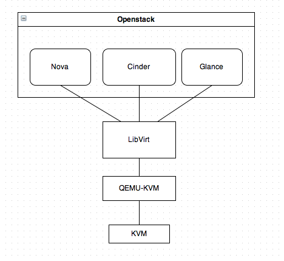
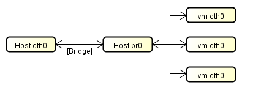
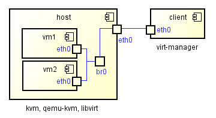
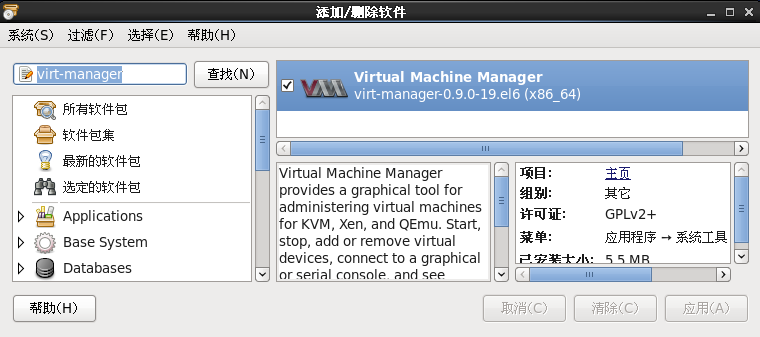
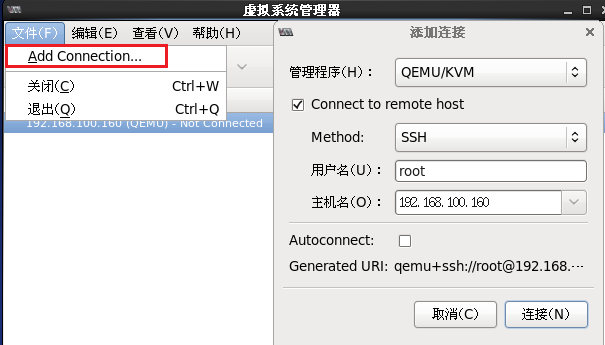
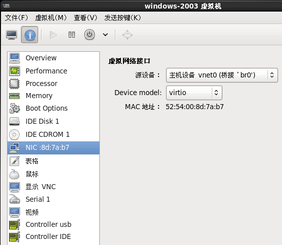

# CentOS 安装 KVM

> 方跃明 2014-04-04

很多人都使用 Openstack，通过 nova 来管理 KVM，对于 KVM 本身其实很陌生，本文理论联系实践，加深对 KVM 的认识。先弄清楚几个概念和关系：

## Openstack、kvm、qemu-kvm、libvirt的关系

* KVM是最底层的hypervisor，它是用来模拟CPU的运行，它缺少了对network和周边I/O的支持，是没法直接用的。
* QEMU-KVM就是建基于KVM上面的，它提供了完整的网络和I/O支持。
* Openstack不直接控制qemu-kvm，它使用一个叫libvirt的库间接控制qemu-lvm。
* libvirt提供了跨VM平台的功能，除了QEMU的模拟器，还可以控制vmware、virtualbox、xen等。为了实现openstack的跨VM特性，openstack使用libvirt，而不直接用qemu-kvm。libvirt还提供了一些高级的功能，例如pool/vol管理。



## 虚拟机服务器和客户端的关系

| 位置       | 组件                                                 |
| ---------- | :--------------------------------------------------: |
| 服务端     | kvm、qemu-kvm、libvirt、python-virtinst、virt-viewer |
| 客户端     | virt-manager                                         |

一般来说，服务器端尽可能的只安装必要的服务器组件，以避免性能问题、误操作和漏洞攻击等等，而管理服务器的客户端软件安装在客户端。当然，服务端和客户端在同一个操作系统的情况也是允许的，经常用在实验环境，但部署在生产环境应该极力避免。

## 部署KVM

### 一、前提条件

检查CPU虚拟化是否支持kvm；最小化安装CentOS；关闭SELinux、关闭iptables或者打开相应的防火墙端口。

检查CPU是否支持虚拟化，用以下命令，其中vmx对应intel，svm对应amd，运行后如果有对应输出则支持虚拟化，无输出则表面不支持虚拟化。

```shell
cat /proc/cpuinfo | grep -E '(vmx|svm)'
```

在/etc/sysconfig/selinux中设置参数selinux=0，关闭SELinux。

### 二、服务器端安装KVM服务

安装kvm服务端及相关组件，其中python-virtinst用于在创建虚拟机时编辑配置文件， virt-viewer用于客户端管理器管理虚拟机时开启图形控制台，防止黑屏。

```shell
yum install kvm qemu-kvm libvirt  python-virtinst  virt-viewer
```

启动libvirt服务

```shell
/etc/init.d/libvirtd start
```

查看kvm服务是否正常，目前没任何虚拟机，所以没有内容显示
进入virsh后，可以使用virsh的相关指令。help为帮助，exit退出virsh。

```shell
virsh
list
```

### 三、服务器端网络设置

虚拟机接入网络常用有两种方式，一种是NAT一种是Brigde，一般采用Brigde方式。



桥接模式需要设置，首先，创建一个文件“/etc/sysconfig/network-scripts/ifcfg-br0”：

```ini
# /etc/sysconfig/network-scripts/ifcfg-br0
DEVICE=br0
ONBOOT=yes
TYPE=Bridge             #注意大小写
BOOTPROTO=static
IPADDR=192.168.255.180
NETMASK=255.255.255.0
GATEWAY=192.168.255.254
```

其次，修改“/etc/sysconfig/network-scripts/ifcfg-eth0”：

```ini
# /etc/sysconfig/network-scripts/ifcfg-eth0
DEVICE=eth0
NM_CONTROLLED=no    #必须关闭NM_CONTROLLED
BOOTPROTO=none      #由于是桥接，BOOTPROTO=none，不要配置IP等信息
ONBOOT=yes          #启动时连接网卡
BRIDGE=br0          #桥接到br0
```

重启网络服务

```shell
/etc/init.d/network restart
```

查看桥接网络

```shell
brctl show
```

| bridge name |     bridge id     | STP enabled | interfaces |
| ----------- | ----------------- | ----------- | ---------- |
| br0         | 8000.00e081de016c | no          | eth0       |
| virbr0      | 8000.5254009219a2 | yes         | virbr0-nic |

四、kvm与virt-manager的关系**

virt-manager图形化管理工具一般装在客户端桌面系统上，管理kvm host的虚拟网络、存储、网络接口，vm的创建、配置、删除、启动关机等。



### 五、客户端安装及使用virt-manager

* 客户端需要CentOS桌面系统。在“主菜单”→“系统”→“管理”→“添加/删除软件”中查找“virt-manager”，找到后，点击“应用”，进行安装。
* 安装完成后，打开方式位于“主菜单”→“系统工具”→“虚拟系统管理器”。







### 六、VNC的使用

对应KVM服务器一般采用OpenStack、CloudStack等等工具利用浏览器来进行管理，这些工具安装配置更加复杂。
而virt-manager虽然简单，但目前为止还没有Windows版本。对于习惯Windows的用户，随时随地就能使用Linux桌面比较困难。因此需要VNC连接到Linux桌面客户端再利用virt-manager管理虚拟服务器。
建议在装有virt-manager的Linux桌面上安装VNC服务器，并开启VNC服务，以便Windows用户使用VNC客户端进行控制。

### 七、需要进阶掌握的内容

1. libvirt命令行
2. 深入理解kvm相关概念
3. linux相关概念、命令及shell编程