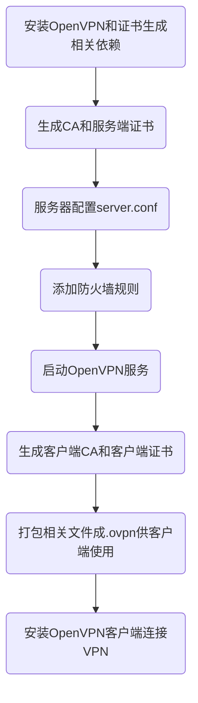

# CentOS安装配置OpenVPN

这个就不多说了，真的不能多说……

## 环境

 环境    | 版本        | 说明
---------|-------------|------
CentOS   | el8         | 兼容el7
easy-rsa | 3.0.6-1.el7 |
openvpn  | 2.4.8-1.el7 |

## 流程



## 安装依赖

```shell
dnf install net-tools
# 强烈建议使用国内repo源，如：阿里云
wget -O /etc/yum.repos.d/epel.repo http://mirrors.aliyun.com/repo/epel-7.repo
dnf install openvpn easy-rsa
```

## 目录结构

```
|-- easy-rsa                # 证书制作工具
|   |-- pki                 #   PKI
|   `-- vars                #   easy-rsa配置
|-- certs                   # 证书存放目录
|   |-- server              #   服务端
|   |   |-- ca.crt          #     CA根证书
|   |   |-- ta.key          #     TLS鉴权密钥
|   |   |-- dh.pem          #     SSL协商DH
|   |   |-- server.crt      #     服务器证书
|   |   `-- server.key      #     服务器私钥
|   `-- client              # 证书客户端
|       `-- user01          #   用户01
|           |-- ca.crt      #     CA根证书
|           |-- ta.key      #     TLS鉴权密钥
|           |-- user01.crt  #     用户证书
|           |-- user01.key  #     用户私钥
|           `-- user01.ovpn #     OpenVPN客户端集成配置
|-- client                  # 密码用户配置（固定IP）
|   |-- user1               #   用户1
|   `-- user2               #   用户2
`-- sever.conf              # 服务端配置：openvpn@server
```

## 配置easy-rsa

```shell
cp -r /usr/share/easy-rsa/3.0.6/ /etc/openvpn/easy-rsa/
cp /usr/share/doc/easy-rsa-3.0.3/vars.example /etc/openvpn/easy-rsa/vars
vim /etc/openvpn/vars
```

```ini
# 请根据需要修改，否则使用默认值
set_var EASYRSA_REQ_COUNTRY    "US"
set_var EASYRSA_REQ_PROVINCE   "California"
set_var EASYRSA_REQ_CITY       "San Francisco"
set_var EASYRSA_REQ_ORG        "Copyleft Certificate Co"
set_var EASYRSA_REQ_EMAIL      "me@example.net"
set_var EASYRSA_REQ_OU         "My Organizational Unit"
```

## 服务端

### 创建PKI、CA、证书、密钥

```shell
cd /etc/openvpn/easy-rsa
### 创建PKI
./easyrsa init-pki
# Note: using Easy-RSA configuration from: ./vars
# Your newly created PKI dir is: /etc/openvpn/easy-rsa/pki
### 创建新的CA，不使用密码
./easyrsa build-ca nopass
# Common Name (eg: your user, host, or server name) [Easy-RSA CA]: # 直接回车
# Your new CA certificate file for publishing is at: /etc/openvpn/easy-rsa/pki/ca.crt
### 创建服务端证书和密钥
./easyrsa gen-req server nopass
# Common Name (eg: your user, host, or server name) [server]: # 直接回车，默认server
# Keypair and certificate request completed. Your files are:
# req: /etc/openvpn/easy-rsa/pki/reqs/server.req
# key: /etc/openvpn/easy-rsa/pki/private/server.key
### 签约服务端证书
./easyrsa sign server server
# Request subject, to be signed as a server certificate for 1080 days:
# subject=
#    commonName                = server
# Type the word 'yes' to continue, or any other input to abort.
#  Confirm request details: yes # 输入yes回车
### 创建Diffie-Hellman
./easyrsa gen-dh
# DH parameters of size 2048 created at /etc/openvpn/easy-rsa/pki/dh.pem
### 创建tls-auth key
openvpn --genkey --secret ta.key
```

### 整理密钥和证书

```shell
cd /etc/openvpn/certs/server
cp /etc/openvpn/easy-rsa/pki/dh.pem .
cp /etc/openvpn/easy-rsa/ta.key .
cp /etc/openvpn/easy-rsa/pki/ca.crt .
cp /etc/openvpn/easy-rsa/pki/issued/server.crt .
cp /etc/openvpn/easy-rsa/pki/private/server.key .
```

### 配置服务器

```ini
# /etc/openvpn/server.conf
# 其样本位于/usr/share/doc/openvpn-2.4.8/sample/sample-config-files/server.conf
port 1194 # 监听的端口号
proto udp # 服务端用的协议，一般用稍快的udp
dev tun
ca /etc/openvpn/server/certs/ca.crt # CA 根证书路径
cert /etc/openvpn/server/certs/server.crt # open VPN 服务器证书路径
key /etc/openvpn/server/certs/server.key # open VPN 服务器密钥路径，请勿泄露！
dh /etc/openvpn/server/certs/dh.pem # Diffie-Hellman 算法密钥文件路径
# tls-auth key，参数 0 可以省略，如果不省略，那么客户端配置相应的参数该配成 1。
# 如果省略，那么客户端不需要 tls-auth 配置
tls-auth /etc/openvpn/server/certs/ta.key 0
server 10.8.0.0 255.255.255.0 # OpenVPN子网，默认为 10.8.0.0/24
compress lzo
duplicate-cn   # 允许一个用户多个终端连接
keepalive 10 120
comp-lzo
persist-key
persist-tun
verb 3
explicit-exit-notify 1
```

### 启动服务

```shell
systemctl start openvpn@server    # 启动
systemctl enable openvepn@server  # 设置自启动
firewall-cmd --zone=public --add-port=1194/udp --permanent  # success
firewall-cmd --reload             # 开发防火墙端口并重载防火墙
```

## 证书客户端

多个客户端请自行重复以下操作

### 创建证书和密钥

```shell
cd /etc/openvpn/easy-rsa
### 创建服务端证书和密钥
./easyrsa gen-req user01 nopass
# Common Name (eg: your user, host, or server name) [user01]: # 直接回车
# Keypair and certificate request completed. Your files are:
# req: /etc/openvpn/client/easy-rsa/pki/reqs/user01.req
# key: /etc/openvpn/client/easy-rsa/pki/private/user01.key
### 签约客户端证书
./easyrsa sign client user01
# Request subject, to be signed as a client certificate for 1080 days:
# subject=
#     commonName                = user01
# Type the word 'yes' to continue, or any other input to abort.
#  Confirm request details: yes # 输入yes回车
```

### 整理证书和密钥

```shell
cd /etc/openvpn/certs/client/user01
cp /etc/openvpn/easy-rsa/ta.key .
cp /etc/openvpn/easy-rsa/pki/ca.crt .
cp /etc/openvpn/easy-rsa/pki/issued/user01.crt .
cp /etc/openvpn/easy-rsa/pki/private/user01.key .
```

### 证书客户端配置ovpn文件

```
client
dev tun
proto udp
remote your.openvpn.server 1194
resolv-retry infinite
nobind
persist-key
persist-tun
remote-cert-tls server
cipher AES-256-CBC
comp-lzo
nice 0
verb 3
mute 10
key-direction 1
<tls-auth>
ta.key 文件内容
</tls-auth>
<ca>
ca.crt 文件内容
</ca>
<cert>
client.crt 文件内容
</cert>
<key>
client.key 文件内容
</key>
```

## 密码客户端

### 用户认证脚本

```shell
#!/bin/sh
###########################################################
# checkpsw.sh (C) 2004 Mathias Sundman <mathias@openvpn.se>
#
# This script will authenticate OpenVPN users against
# a plain text file. The passfile should simply contain
# one row per user with the username first followed by
# one or more space(s) or tab(s) and then the password.
###########################################################

PASSFILE="/etc/openvpn/psw-file"
LOG_FILE="/etc/openvpn/openvpn-password.log"
TIME_STAMP=`date "+%Y-%m-%d %T"`

if [ ! -r "${PASSFILE}" ]; then
  echo "${TIME_STAMP}: Could not open password file \"${PASSFILE}\" for reading." >> ${LOG_FILE}
  exit 1
fi

CORRECT_PASSWORD=`awk '!/^;/&&!/^#/&&$1=="'${username}'"{print $2;exit}' ${PASSFILE}`

if [ "${CORRECT_PASSWORD}" = "" ]; then
  echo "${TIME_STAMP}: User does not exist: username=\"${username}\", password=\"${password}\"." >> ${LOG_FILE}
  exit 1
fi

if [ "${password}" = "${CORRECT_PASSWORD}" ]; then
  echo "${TIME_STAMP}: Successful authentication: username=\"${username}\"." >> ${LOG_FILE}
  exit 0
fi

echo "${TIME_STAMP}: Incorrect password: username=\"${username}\", password=\"${password}\"." >> ${LOG_FILE}
exit 1
```

```shell
# 赋予可执行权限
chmod +x /etc/openvpn/checkpsw.sh
```

### 用户密码文件

位于`/etc/openvpn/psw-file`

```
user1 passwd1
user2 passwd2
# chown nobody.nobody /etc/openvpn/psw-file
```

### 用户固定IP配置

```shell
vi /etc/openvpn/client/user1
# chown -R nobody.nobody /etc/openvpn/client
```

```
ifconfig-push  10.8.0.9  10.8.0.10
```

`ifconfig-push`中的每一对IP地址表示虚拟客户端和服务器的IP端点。
它们必须从连续的/30子网网段中获取(这里是/30表示xxx.xxx.xxx.xxx/30，即子网掩码位数为30)，以便于与Windows客户端和TAP-Windows驱动兼容。
明确地说，每个端点的IP地址对的最后8位字节必须取自下面的集合：

```
[1, 2]    [5, 6]    [9, 10]   [ 13, 14] [ 17, 18]
[21, 22]  [25, 26]  [ 29, 30] [ 33, 34] [ 37, 38]
[41, 42]  [45, 46]  [ 49, 50] [ 53, 54] [ 57, 58]
[ 61, 62] [65, 66]  [ 69, 70] [ 73, 74] [ 77, 78]
[ 81, 82] [ 85, 86] [ 89, 90] [ 93, 94] [ 97, 98]
[101,102] [105,106] [109,110] [113,114] [117,118]
[121,122] [125,126] [129,130] [133,134] [137,138]
[141,142] [145,146] [149,150] [153,154] [157,158]
[161,162] [165,166] [169,170] [173,174] [177,178]
[181,182] [185,186] [189,190] [193,194] [197,198]
[201,202] [205,206] [209,210] [213,214] [217,218]
[221,222] [225,226] [229,230] [233,234] [237,238]
[241,242] [245,246] [249,250] [253,254]
```

### 修改服务器配置支持用户密码登录

```
script-security 3
auth-user-pass-verify /etc/openvpn/checkpsw.sh via-env # 指定用户认证脚本
username-as-common-name
verify-client-cert none
client-cert-not-required              # 非双重验证，仅用户名密码验证
client-config-dir /etc/openvpn/client # 客户端配置（固定IP）
```

### 密码客户端配置文件ovpn

```
client
dev tun
proto udp
remote your.openvpn.server 1194
resolv-retry infinite
nobind
persist-key
persist-tun
remote-cert-tls server
auth-nocache
auth-user-pass
cipher AES-256-CBC
comp-lzo
nice 0
verb 3
mute 10
key-direction 1
<tls-auth>
ta.key 文件内容
</tls-auth>
<ca>
ca.crt 文件内容
</ca>
```

## OpenVPN客户端

OpenVPN UI [官方下载地址](https://openvpn.net/community-downloads)，鉴于需科学上网，请自行解决下载。

安装并运行，导入制作好的ovpn文件，连接，若启用密码验证，输入用户名密码，确定，即可连接VPN。

## 提醒

- 启用密码验证则不能仅依赖证书通过验证，但密码验证可启用证书进行双重验证
- 大型商业用户可以使用付费便于管理的`OpenVPN Access Server`，使用`OpenVPN Connect`客户端连接VPN。

> 方跃明
> 2020-01-29