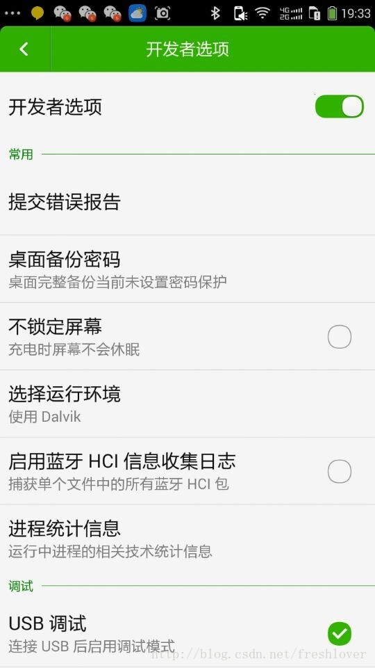
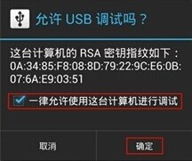
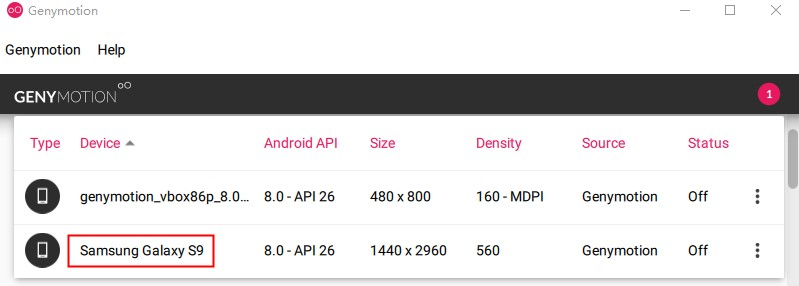
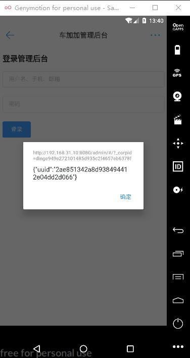
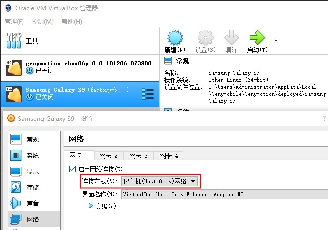
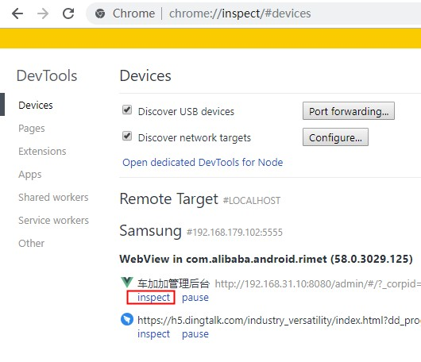
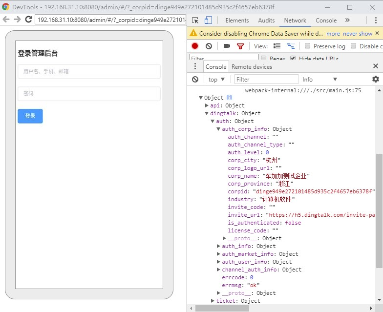

# Chrome inspect 开发钉钉应用

> 方跃明 2019-04-07

`Chrome inspect`是`Chrome`浏览器基于`webkit remote debug`的实现，支持`Android`模拟器和`Android`真实设备。

但由于国情所致，国内`Android`大部分手机对于`Google Mobile Service`的支持甚是微弱，很多设备甚至完全阉割，且无法安装。

因此，推荐使用未被阉割的`Android`模拟器进行开发。

:::tip
由于国情所致，下载和访问页面可能产生不可预期的错误，请自行解决。
:::

## 钉钉开发版

钉钉正式版不支持`Chrome inspect`，请在[钉钉开发者工具][dingtalk-dev]中下载钉钉开发版。

## 真机调试

真机使用USB连接到电脑，打开开发者模式，允许调试，才能被`Chrome inspect`发现。

## 模拟器

推荐[下载][genymotion-download]对开发支持良好的 [Genymotion] Android模拟器，若无`VirtualBox`环境请选择`with VirtualBox`的安装包。
一般使用默认安装方式，安装时请注意选择`Personal User`免费使用，土豪随意。

:::warning 友情提示
请勿下载夜神、mumu之类的模拟器（~~游戏机~~）。
:::

## 虚拟机

打开`Genymotion`模拟器，请选择较高版本的虚拟设备模板，点击右侧菜单`INSTALL`，下载完成自动安装。

回到`Genymotion`模拟器，启动虚拟机，默认已经打开开发者模式。

将钉钉开发版拖入虚拟机中，完成安装，打开钉钉应用，进入钉钉微应用。

:::tip 离线下载
若网络环境慢需要离线下载模板包，请打开`C:\Users\your-name\AppData\Local\Genymobile\genymotion.log`日志，查找`.ova`（`VirtualBox`模板格式）字符串。
得到你想离线下载的文件链接，使用迅雷极速版等符合国情的下载工具下载，完成后双击导入`VirtualBox`。
:::

若错误请根据错误提示解决问题，比如网络配置错误：

## Chrome inspect

使用`Chrome`浏览器打开`chrome://inspect/#devices`新标签页，将`Remote Target`下对应设备的对应页面`inspect`到桌面端的`Chrome`。

正常情况进入调试页面。

:::danger 谨防受骗
国情问题，很可能会弹出空白页面或者404错误页面（`HTTP/1.1 404 Not Found`）。
据说有`Chrome inspect`对应的`WebView`离线工具解决，可能需要付费，请务必谨慎。
:::

[dingtalk-dev]: https://open-doc.dingtalk.com/microapp/kn6zg7
[genymotion-download]: https://www.genymotion.com/download
[genymotion]: https://www.genymotion.com
