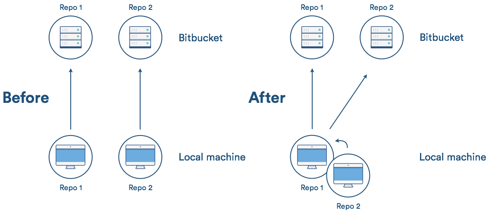

# 图解 Git 常用操作

> 图片来自网络，侵删

## git

你真的需要记住那么多 Git 操作吗？
也许阮一峰老师的[《常用Git命令清单》](http://www.ruanyifeng.com/blog/2015/12/git-cheat-sheet.html)就够了。


## git subtree

项目包含子项目这么办？是时候让你出场了！show time！

- [git subtree教程](https://segmentfault.com/a/1190000012002151)
- [用 Git Subtree 在多个 Git 项目间双向同步子项目](https://segmentfault.com/a/1190000003969060)



```shell
# 克隆主项目仓库到本地
git clone https://coding.net/axolo/lcoamaxy
# 建立子项目，并从远程克隆子项目到本地对应目录
git subtree add --prefix=www origin coding-pages
# 主项目正常提交
git add --all
git commit -m "use git subtree"
git push
# 提交子项目的变更到远程仓库
git subtree push -P www/ origin coding-pages
# 从远程获取子项目的变更
git subtree pull -P www/ origin coding-pages
# 在子项目生成新分支hotfix-001
git subtree push -P www/ origin hotfix-001
```

> 方跃明
> 2018-4-28
