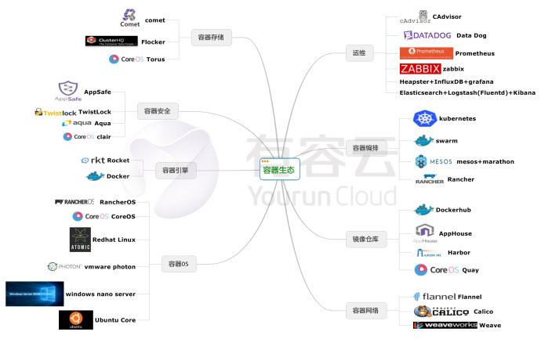
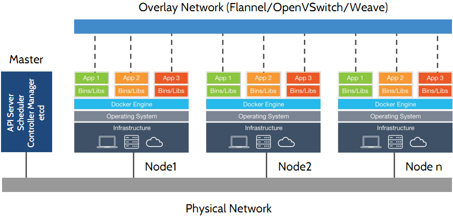
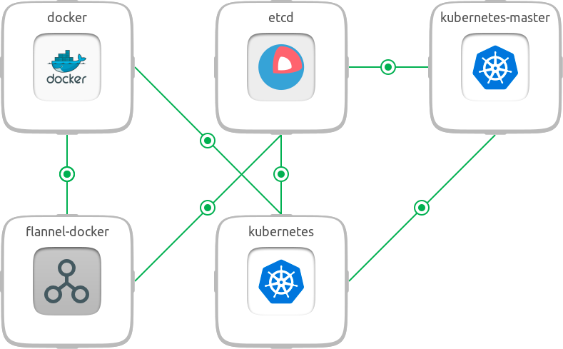
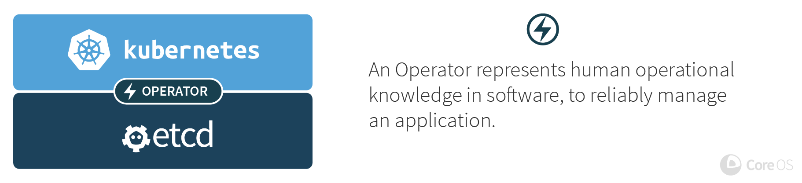
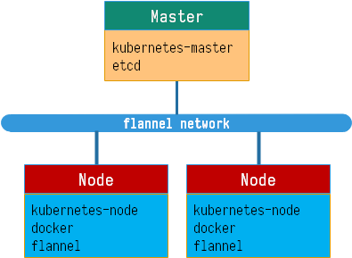

# Kubernetes 安装指南



## 简介

### kubernetes

kubernetes（简称k8s）是Google开源的容器集群管理系统。它构建Ddocker技术之上，为容器化的应用提供资源调度、部署运行、服务发现、扩容缩容等整一套功能，本质上可看作是基于容器技术的mini-PaaS平台。



### kubernetes-master

- kube-apiserver：k8s的管理接口
- kube-scheduer：k8s调度器，容器的启动、迁移、扩容缩减时候，选择哪个node，就看它了。
- kube-controller-manager：k8s对node的控制行为，比如怎么去调用node启动一个容器。

### kubernetes-node

- kubelet：负责node的管理，基本所有操作都靠它。
- kube-proxy：每个node里的container都在一个私有网络中，kube-proxy的作用就是做一个反向代理，让访问者访问这个node的时候，可以转发到内部对应的container。

### flannel

flannel可以为容器提供网络服务。其模型为全部的容器使用一个network，然后在每个host上从network中划分一个子网subnet。为host上的容器创建网络时，从subnet中划分一个ip给容器。其采用目前比较流行的no server的方式，即不存在所谓的控制节点，而是每个host上的flanneld从一个etcd中获取相关数据，然后声明自己的子网网段，并记录在etcd中。其他的host对数据转发时，从etcd中查询到该子网所在的host的ip，然后将数据发往对应host上的flanneld，交由其进行转发。根据kubernetes的模型，即为每个pod提供一个ip。flannel的模型正好与之契合。因此flannel是最简单易用的kubernetes集群网络方案。



### etcd

在分布式系统中，如何管理节点间的状态一直是一个难题，etcd像是专门为集群环境的服务发现和注册而设计，它提供了数据TTL失效、数据改变监视、多值、目录监听、分布式锁原子操作等功能，可以方便的跟踪并管理集群节点的状态。etcd的特性如下：

- 简单: curl可访问的用户的API（HTTP+JSON）
- 安全: 可选的SSL客户端证书认证
- 快速: 单实例每秒 1000 次写操作
- 可靠: 使用Raft保证一致性

etcd是CoreOS的核心组件，负责节点间的服务发现和配置共享，运行在CoreOS中的应用可以通过etcd读取或者写入数据。虽然etcd是为CoreOS而设计，但其可以运行在多个平台上，包括 OS X、Linux、BSD。角色功能如下：

- 作为kubernetes的数据库，存储了k8s自身的信息、以及各种业务容器信息等。
- 存储flannel网络配置信息，供各节点协调。



### docker

Docker 是一个开源的应用容器引擎，让开发者可以打包他们的应用以及依赖包到一个可移植的容器中，然后发布到任何流行的Linux机器上，也可以实现虚拟化，容器是完全使用沙箱机制，相互之间不会有任何接口。一个完整的Docker有以下几个部分组成：

- Client：客户端
- Daemon：守护进程
- Container：容器
- Image：镜像


## 规划

本例虽然均用IP进行操作，但是建议部署的时候，建议用hosts或者DNS取代IP。

|  类型  |              组件              | 数量  |             IP              |
| ------ | ------------------------------ | :---: | --------------------------- |
| Master | kubernetes-master etcd         |   1   | 192.168.20.25               |
| Node   | kubernetes-node docker flannel |   2   | 192.168.20.22 192.168.20.26 |



### 前提

- SELinux关闭
- firewalld开放8080、2379端口

## 配置

### etcd配置

```bash
# 安装
yum install etcd
```

```ini
# 配置 /etc/etcd/etcd.conf
ETCD_NAME=default
ETCD_DATA_DIR="/var/lib/etcd/default.etcd"
ETCD_LISTEN_CLIENT_URLS="http://0.0.0.0:2379"
ETCD_ADVERTISE_CLIENT_URLS="http://192.168.20.25:2379"
```

```bash
# 启动
systemctl enable etcd
systemctl start etcd
```

```bash
etcdctl set /coreos.com/network/config '{ "Network": "10.1.0.0/16" }'
```

#### master

```bash
# 安装
yum install kubernetes-master
```

```ini
# 配置 /etc/kubernetes/apiserver
KUBE_API_ADDRESS="--address=0.0.0.0"
KUBE_ETCD_SERVERS="--etcd_servers=http://192.168.20.25:2379"
KUBE_SERVICE_ADDRESSES="--service-cluster-ip-range=10.254.0.0/16"
KUBE_ADMISSION_CONTROL="--admission_control=NamespaceLifecycle,NamespaceExists,LimitRanger,SecurityContextDeny,ResourceQuota"
KUBE_API_ARGS=""
```

```ini
# 配置 /etc/kubernetes/controller-manager
KUBE_CONTROLLER_MANAGER_ARGS="--node-monitor-grace-period=10s --pod-eviction-timeout=10s"
```

```ini
# 配置 /etc/kubernetes/config
KUBE_LOGTOSTDERR="--logtostderr=true"
KUBE_LOG_LEVEL="--v=0"
KUBE_ALLOW_PRIV="--allow_privileged=false"
KUBE_MASTER="--master=http://192.168.20.25:8080"
```

```bash
# 启动服务
systemctl enable kube-apiserver kube-scheduler kube-controller-manager
systemctl start kube-apiserver kube-scheduler kube-controller-manager
```

### node

```bash
# 安装
yum install kubernetes-node flannel docker
```

```ini
# 配置 /etc/kubernetes/config
KUBE_LOGTOSTDERR="--logtostderr=true"
KUBE_LOG_LEVEL="--v=0"
KUBE_ALLOW_PRIV="--allow_privileged=false"
KUBE_MASTER="--master=http://192.168.20.25:8080"
```

```ini
# 配置 /etc/kubernetes/kubelet
KUBELET_ADDRESS="--address=127.0.0.1"
KUBELET_HOSTNAME="--hostname_override=192.168.20.22"
KUBELET_API_SERVER="--api_servers=http://192.168.20.25:8080"
KUBELET_ARGS="--pod-infra-container-image=kubernetes/pause"
```

```ini
# 配置 /etc/sysconfig/flanneld
FLANNEL_ETCD="http://192.168.20.25:2379"
FLANNEL_ETCD_KEY="/coreos.com/network"
```

```bash
systemctl enable kubelet kube-proxy flanenld docker
systemctl start kubelet kube-proxy flanneld docker
```
