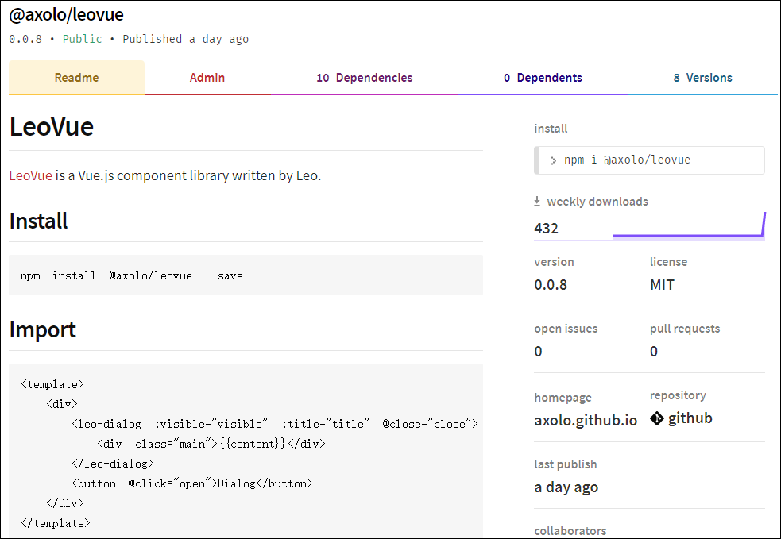

# LeoVue 打包发布 NPM 折腾记

> 方跃明 2018-08-18

详尽步骤细述 Vue 组件库如何发布到 npm。
## 发布步骤

### 建立项目并发布

```shell
npm install vue-cli -g          # 安装 vue 命令行工具
vue init webpack-simple leovue  # 生成 package.json，请按需填写
cd leovue                       # 配置webpack、编写并调试项目，各种折腾
npm build                       # 可能会遇到各种错误，请按提示解决
npm login                       # 按提示登录 npmjs.com，可能需要再次激活您的邮箱
npm publish                     # 按提示排错，比如包的命名问题等等，直至成功
```

::: tip 建议
因为`npm`的传输问题、排错问题、稳定性问题等等，强烈建议用`yarn`来代替`npm`。
:::

### package.json

```json
{
  "name": "@axolo/leovue",
  "description": "LeoVue components lib",
  "version": "0.0.8",
  "author": "Yueming Fang",
  "license": "MIT",
  "homepage": "https://axolo.github.io/leovue",
  "repository": {
    "type": "git",
    "url": "https://github.com/axolo/leovue.git"
  },
  "keywords": ["vue", "html5"],
  "main": "./dist/leovue.js",
  "scripts": {
    "build": "cross-env NODE_ENV=production webpack --progress --hide-modules"
  },
  "dependencies": {
    "vue": "^2.5.11"
  },
  "browserslist": [
    "> 1%",
    "last 2 versions",
    "not ie <= 8"
  ],
  "devDependencies": {
    "babel-core": "^6.26.0",
    "babel-loader": "^7.1.2",
    "babel-preset-env": "^1.6.0",
    "babel-preset-stage-3": "^6.24.1",
    "cross-env": "^5.0.5",
    "css-loader": "^0.28.7",
    "file-loader": "^1.1.4",
    "vue-loader": "^13.0.5",
    "vue-template-compiler": "^2.4.4",
    "webpack": "^3.6.0",
    "webpack-dev-server": "^2.9.1"
  }
}
```



上图是`package.json`跟`npmjs.com`内容关系图，`keywords`在项目主页底部，
`README.md`内容显示在主页，`version`、`license`、`homepage`、`repository`信息在右侧。

## 需求实现

### 多组件

```js
// 入口文件：./src/index.js
// 即webpack.config.js里的：entry: './src/index.js'
import LeoDialog from './components/LeoDialog'
import LeoLodop   from './components/LeoLodop'

const components = [ LeoDialog, LeoLodop ]
const install = function (Vue, opts = {}) {
  components.forEach(component => {
    Vue.component(component.name, component)
  })
}

if (typeof window !== 'undefined' && window.Vue) {
  install(window.Vue)
}

export { LeoDialog, LeoLodop }
```

### 精简发布

```ini
# 以下内容添加到.npmignore后
# 仅README.md和package.json和/dist目录被发布
/*
!/dist/
!README.md
!package.json
```

## 错误解决

::: warning 属性只读
Uncaught TypeError: Cannot assign to read only property 'exports' of object '`#<Object>`'
:::

翻译过来就是说，代码没毛病，在webpack打包的时候，可以在js文件中混用require和export。但是不能混用import以及module.exports 。
因为webpack 2中不允许混用import和module.exports，解决办法就是统一改成ES6的方式编写即可。

```js
import { Component } from 'components'
// moduler.exports = Component    // 混用可通过Webpack2编译，但使用错误
export default Component
```

::: warning 标签未知
Unknown custom element: `<component>` - did you register the component correctly?
For recursive components, make sure to provide the "name" option.
:::

一般情况下是组件未被正确加载，或者组件打包时命名错误。比如以`export default Component`打包，
却以`import { Component } from 'components'`来引用，多了个花括号，反之亦然。

::: warning 渲染未知
[Vue warn]: Failed to mount component: template or render function not defined.
found in `<Component>`
:::

打包需要指定一种模块输出类型，可以是commonjs,AMD,script,UMD模式。
在这里是写插件，要采用UMD模式，即libraryTarget: 'umd'。
于是webpack.config.js出口文件配置修改为：

```js
 output: {
  path: path.resolve(__dirname, './dist'),
  publicPath: '/dist/',
  filename: 'leovue.js',
  library: 'leovue',
  libraryTarget: 'umd',
  umdNamedDefine: true
 }
```

## 参考

[vue todo-list组件发布到npm上的方法](https://www.jb51.net/article/137725.htm)