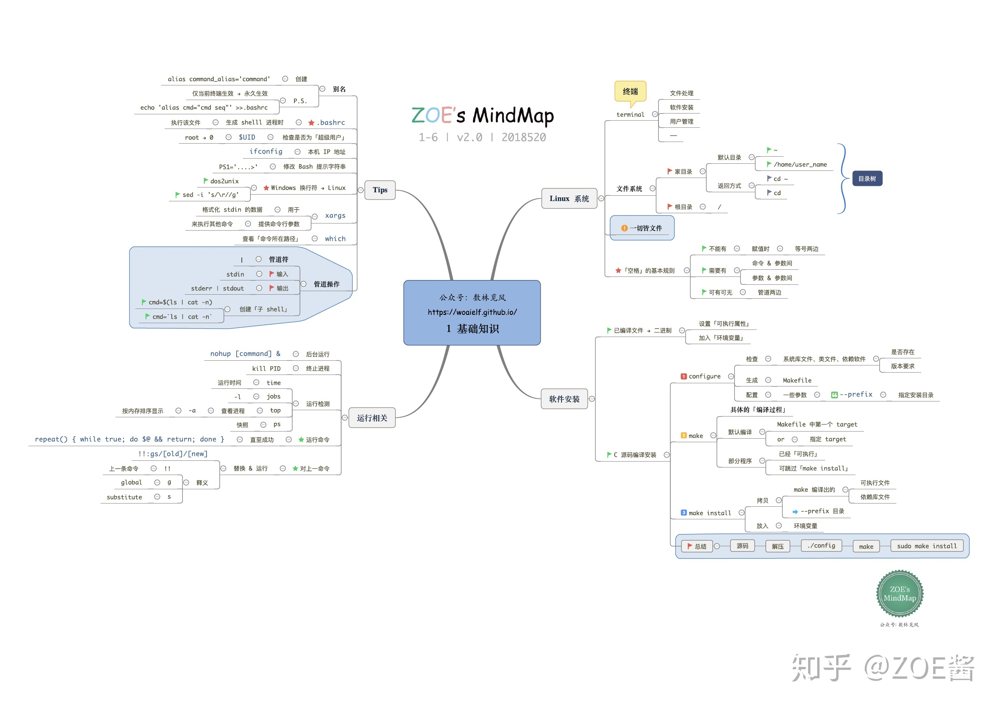
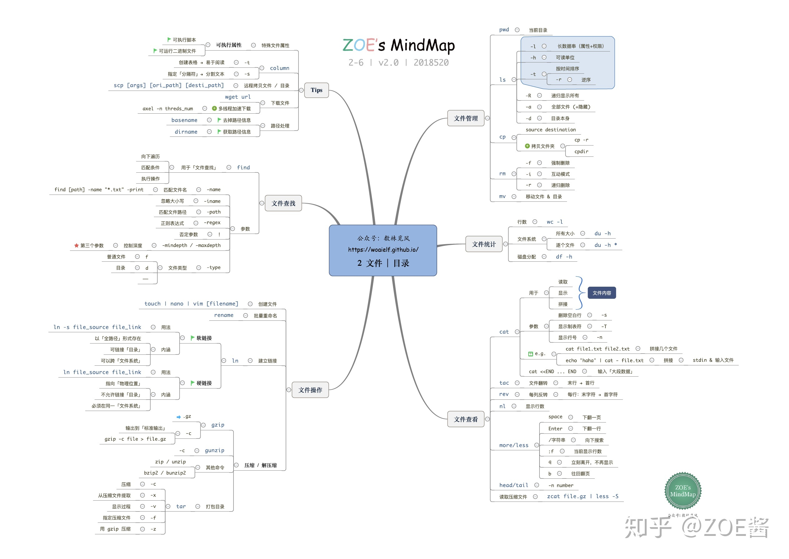
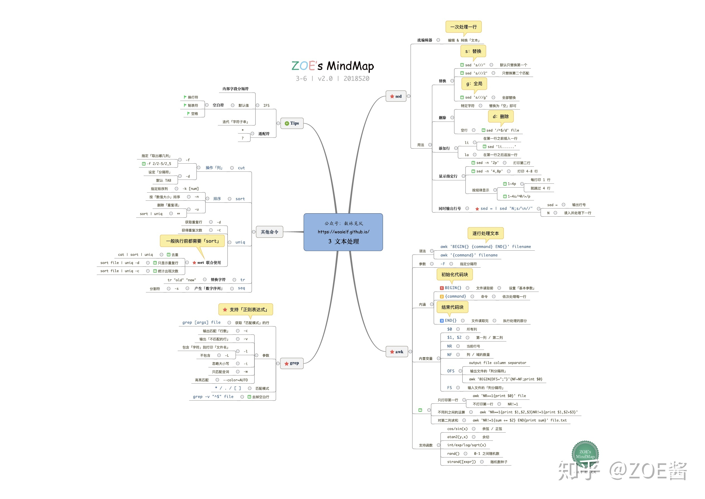
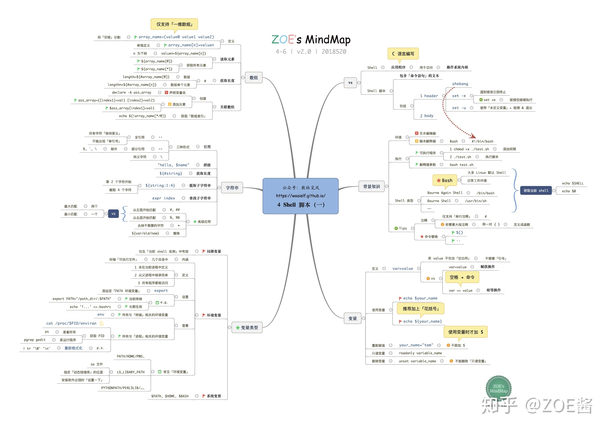
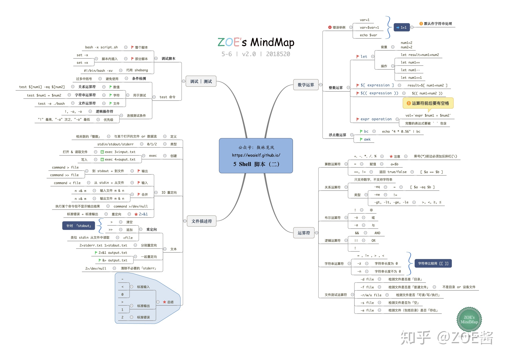
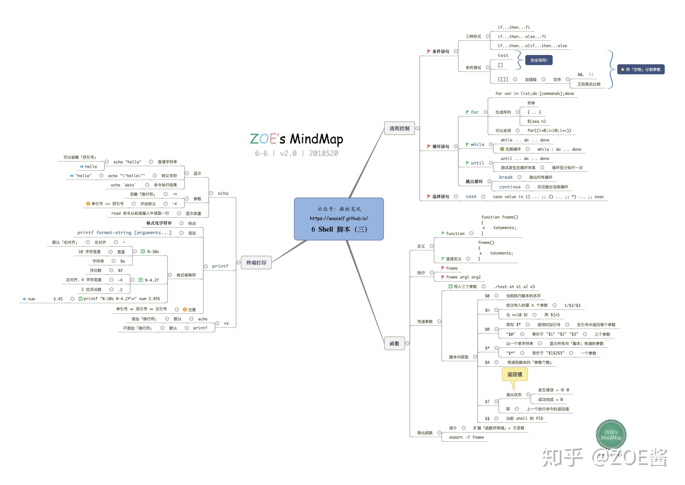

# Linux Shell 入门

## 脚本文件

- 扩展名：`.sh`
- 第一行：`#!/bin/bash`
- 执行
  - `chmod +x shell脚本`
  - `./shell脚本`

## 脚本内部执行命令

反引号

## 变量

### 系统变量

|   名称   |                          说明                           |
| -------- | ------------------------------------------------------- |
| PATH     | shell查找命令的目录列表，由冒号分隔                     |
| HOSTNAME | 当前主机名                                              |
| HOME     | 当前用户主目录                                          |
| SHELL    | 当前shell                                               |
| USER     | 当前用户                                                |
| UID      | 当前用户ID                                              |
| GID      | 当前用户组ID                                            |
| PWD      | 当前所在目录                                            |
| OLDPWD   | 上次所在目录                                            |
| 0        | 当前命令名称                                            |
| n        | 当前命令的第n个参数，n=1,2,...,9                        |
| *        | 以”参数1，参数2…..”形式保存所有参数                     |
| @        | 以”参数1”，”参数2”…..”形式保存所有参数                  |
| #        | 命令行参数的个数                                        |
| ?        | 执行上一个指令或函数的返回值，0=没有错误                |
| $        | 本程序的PID（ProcessID）                                |
| !        | 后台运行的最后一个进程的进程ID号                        |
| -        | 显示shell使用的当前选项，与set命令功能相同              |
| _        | shell的绝对路径名，最近执行的命令，最近命令最后一个参数 |
| LINENO   | 当前执行的脚本行号                                      |

### 用户变量

#### 定义变量

- 变量名=变量值

#### 引用变量

- $变量名
- ${变量名}

#### 只读变量

- 变量名=变量值
- readonly 变量名

#### 删除变量

- 变量名=变量值
- unset 变量名

### 字符串变量

#### 定义

- 单引号字符串变量='不可转义字符串'
- 双引号字符串变量="可转义字符串"

#### 获取字符串长度

```bash
string="abcd"
echo ${#string}     # 4
```

#### 提取字符串

```bash
string="runoob is a great site"
echo ${string:1:4}  # unoo
```

#### 查找字符串位置

```bash
string="runoob is a great company"
echo `expr index "$string" is`  # 8
```

### 数组变量

#### 定义数组

```bash
array_name=(value0 value1 value2 value3)  # 整体定义，可分行
array_name[0]=value0                      # 可单独定义
```

#### 引用

```bash
echo ${array_name[n]}   # 读取第n个数组，数组下标从0开始
echo ${array_name[*]}   # 读取所有数组
echo ${array_name[@]}   # 读取所有数组
```

#### 获取长度

```bash
${#array_name[n]}     # 第n个数组长度
${#array_name[*]}     # 整个数组长度
${#array_name[@]}     # 整个数组长度
```

## 运算符

## 控制语句

## 思维导图









> 图片来自网络，侵删

> 未完待续……

> 方跃明
> 2017-08-09
