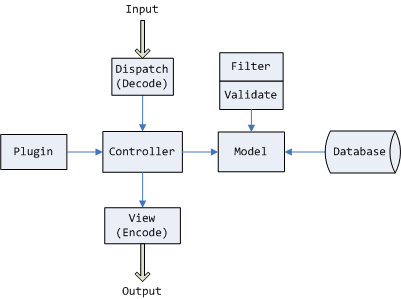

# MVC 及 PHP++、PHP-- 胡思乱想杂记

> <http://user.qzone.qq.com/61077523/blog/1249101307>

有一定经验的开发者都了解MVC模式，特别是基于WEB而且又是可以使用嵌入HTML语言进行开发的，比如PHP。诚然PHP作为一种嵌入式的脚本语言是强大的，这也是一直以来传统PHP给很多人的认知。以至于在PHP3甚至在PHP4时代接触过并最终放弃了PHP的人，都停留在这个认识上，认为PHP没有什么长处，太过简陋。其实不然，从技术角度来讲，一门语言的语法不能决定一个应用的好坏，很多情况下，语言仅仅是实现工具，几乎所有大中型应该都不太会单一的采用一门语言来开发，各种语言都有其自身的长处。

长期以来PHP被杂糅进太多的东西了，要负责Db、又要负责HTML、还要负责Controller、还要负责Model，等等，成了PHP++了。发展到今天，PHP早就脱离了嵌入HTML脚本语言的范畴。应该有更重要的事情给PHP做。当然嵌入HTML当脚本使唤，仍然是强项，但不应该杂糅了。在此换个角度来看PHP。把PHP按角色来理清一下，顺便来发明几个新名词。与数据库层面打交道的叫PHP-Db，与流程控制相关的叫PHP-Controler，与HTML等终端呈现打交道的叫PHP-Client，等等。这样认识可能会更清晰点。

这几天闲来无事，朝思暮想，对MVC的理解有了新的认识，有一点点浅见，于是折腾了一张图。

最大的收获是我们是否需要很肥大的View呢？在各种PHP框架中，View端的语言基本上都采用PHP-Client，比如ZendFramework、QeePHP等，还有的采用模板标签或模板引擎。在我看来这其实是方便开发者使用的，其实对于View，可以精简至极至。图中的Input和Output都涉及到View。精简后的View可以根本就不用去管Input和Output的设备、形式、语言，只需要Input进正确格式的数据（比如JSON、XML），而Output出指定格式的数据（比如JSON、XML）。同样，Output的呈现形式、方法、手段等不是我们要关注的。对于WEB来说可以Output出的数据可以交给ExtJS，可以交给PHP(此时的PHP是WEB前端脚本语言)，可以交给原生Javascript处理。甚至可以以WML语言输出到WAP。也就是说View如何呈现不是核心所要关注的。

然而我们是怎么做的呢？在Controller中很多开发者并不注重数据的格式统一与规划，很随意的就丢给了View。更有甚者Controller和View杂糅了，权责不分，该View做的事让Controller做了，而View又在做Controller的事。不管是从设计简单的网站应用出发还是企业行业应用出发，PHP-Controller都不应该糅进PHP-Client。View里Output出单纯的格式化的数据，有利于AJAX及WebService等。规范了输出，View的呈现就可以由其它团队单独负责，他们爱用PHP，爱用ExtJS，爱用jQuery，爱谁用谁。

至于什么是Model我也理解一下，理解的不对的话，请各位多踹几脚。Model在很多人心里长期以来被Db给占了。而在Controller中写了大量应该Model去完成的内容。广义上说其实Model并不仅仅是Db。比如我们用的FCKeditor我们可以说是一个Model，它用来创建一个可视编辑器。大方面的Model估计都能重视。再说一个小的，比如一个用户系统中的“用户新增（UserAdd）”这个功能，用户端可能是用户注册，管理端可以是直接创建一个用户。如果在控制器里直接写，用户端和管理端那就重复写代码了。这样的功能就应该放到Model里，拿来调用。这个就叫Model，类似函数，也叫业务逻辑。控制器控制的只是业务流程。如果控制器掺和模型的事，凡事诸葛亮，会弄得拥肿无比，非常繁琐，会被累死。

Cache又是一个什么概念呢？一个简单的例子，商品分类列表，当去存取这个列表时，核心就应该先去Cache里找，找到了核对一下是不是要更新，如果没找到或者要更新，那么就先更新或者在Cache里建立一个副本(这显然是一个很小的循环或者是分支判断)。然后把Cache里的列表取出来。这样做是免除大量的去存取数据库操作，或称为大量的Model运算。当然我们可以设计成，如果这个列表有变动就主动去更新Cache。这样命中率会高很多。应该的效率就会提高很多。很多人以为生成静态HTML脚本就是Cache的全部，只是Cache局部小应用，模板引擎里常用。想开了去，放大了说，Cache跟View没直接关系。Cache可以用在View，当然也可以用在Controller和Model。

最近AD挺多，顺路也AD一下：你的PHP--了么？

> 注：PHP-Client、PHP-Controler、PHP-Db等都是作者发明的名词，非专业通用名词

> 方跃明
> 2009-8-1 12:35
