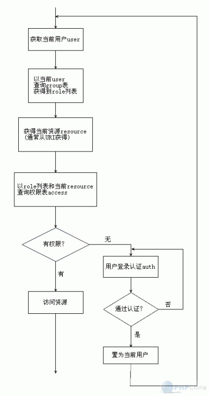
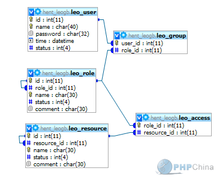
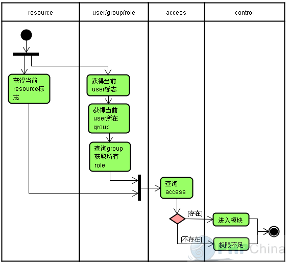
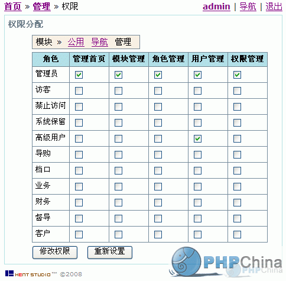
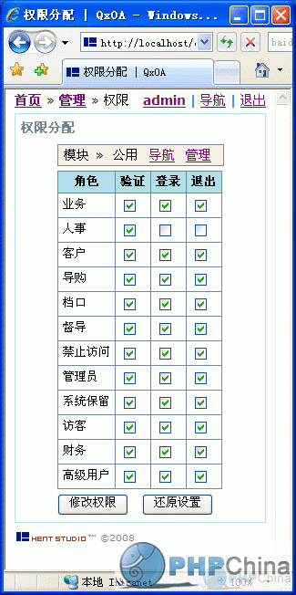

# RBAC之我见

> 方跃明 2009-09-09

最近又开始折腾权限精细控制，发现多年前发的文章，还挺有思路的。摘录如下：

- <http://bbs.phpchina.com/forum.php?mod=redirect&goto=findpost&ptid=105577&pid=877890&fromuid=8531>
- <http://bbs.phpchina.com/forum.php?mod=viewthread&tid=151874&fromuid=8531>

## 一、缘起 Zend_Acl

### 1. 简介

Zend_Acl 为权限管理提供轻量并灵活的访问控制列表 (ACL,access control list) 的实现。一般地，应用软件可以利用这样的功能限制某些特定对象来访问特定保护的对象。
在本文档中：

- resource （资源）是一个限制访问的对象。
- role （角色）是一个可以发出请求去访问Resource的对象。

简单地说就是：roles 请求访问 resources。例如，如果停车服务员要进入汽车，那么，这个停车服务员就是发出请求的 role，而这辆汽车就是 resource，因为不是所有人都有权进入汽车。
通过规范和访问控制列表（ACL）的使用，应用软件可以控制角色（roles）如何来访问资源（resources）。

### 2. 关于资源(Resource)

在 Zend_Acl 中，创建一个 resource 非常简单。Zend_Acl 提供了 resource 接口`Zend_Acl_Resource_Interface` 使开发者在程序中创建 resources 非常容易。为了使Zend_Acl把某个对象当作一个resource，一个类只需要实现这个只包含了一个方法 getResourceId() 的接口。

另外，Zend_Acl_Resource是一个包含在 Zend_Acl 里作为一个基本的 resource 实现的类，开发者可以任意扩展它。
Zend_Acl 提供了一个树结构，它可以添加多个 resources (或者叫“访问控制下的区域”）。因为 resources 被存储在这样一个树结构， 所以它们可以被组织成从一般（树根）到特殊（树叶）。基于特殊resource的查询将自动从resource的等级结构中搜索分配给祖先rResources的规则， 它允许简单的规则继承。

例如，要把一个缺省的规则应用到一个城市的每个建筑物，就简单地把这个规则分配给这个城市， 而不是把规则分配给每个建筑物。然而，有些建筑物也许要求例外的规则，在Zend_Acl里，很容易地通过分配例外规则给每个有这样要求的建筑物来实现。 一个 resource 可以从唯一的一个父 resource 继承，而这个父 resource 也有它自己的父 resource，等等。

Zend_Acl 也支持基于 resources 的权限（例如："create", "read", "update", "delete"）， 所以开发者可以根据 resource 分配影响全部或者特殊权限的规则到一个或多个资源。

### 3. 关于角色(Role)

象 Resources 一样，创建一个 role 也非常简单。 Zend_Acl 提供了 `Zend_Acl_Role_Interface` 使开发者创建 roles 非常容易。 为了使Zend_Acl把某个对象当作一个 role，一个类只需要实现这个只包含了一个方法 getRoleId() 的接口。

另外，Zend_Acl_Role是一个包含在Zend_Acl里作为一个基本的 role 实现的类，开发者可以任意扩展它。
在 Zend_Acl, 一个 role 可以从一个或多个 role 继承，这就是在 role 中支持规则的继承。

例如，一个用户 role，如 “sally”， 可以属于一个或多个 role，如：“editor”和“administrator”。开发者可以分别给“editor”和“administrator”分配规则， 而“sally”将从它们俩继承规则，不需要直接给“sally”分配规则。
虽然从多重角色继承的能力非常有用，但是多重继承也带来了一定程度的复杂性。

下面的例子来示例含糊情形和Zend_Acl如何解决它。

## 二、分析

按ZendFramework的做法ACL（访问控制列表）与Auth（认证）是分开的，我用五张表来实现。

- 用于ACL的有：role、resource、access
- 用于AUTH的有：user
- AUTH和ACL结合的表是：group

很多RBAC笼统的把ACL和AUTH结合在一起了，所以比较混杂，搞不清楚。下面的草图简要说明ACL和AUTH的结合。



## 三、数据模型分析与设计


这个就不多说了，直接贴MySQL代码。

```sql
-- database leogb
DROP DATABASE IF EXISTS hent_leogb;
CREATE DATABASE hent_leogb DEFAULT CHARACTER SET = 'utf8';
USE hent_leogb;
-- for first import
-- table user
CREATE TABLE leo_user (
    id int(11) NOT NULL AUTO_INCREMENT PRIMARY KEY,
    name char(40) NOT NULL UNIQUE KEY,
    password char(32) NOT NULL,
    time datetime NOT NULL,
    status int(4) NOT NULL
) DEFAULT CHARACTER SET = 'utf8' TYPE = 'InnoDB';
-- table role
CREATE TABLE leo_role (
    id int(11) NOT NULL AUTO_INCREMENT PRIMARY KEY,
    role_id int(11) NOT NULL,
    FOREIGN KEY (role_id) REFERENCES leo_role(id) ON UPDATE CASCADE ON DELETE RESTRICT,
    name char(30) NOT NULL UNIQUE KEY,
    status int(4) NOT NULL,
    comment char(30) NOT NULL
) DEFAULT CHARACTER SET = 'utf8' TYPE = 'InnoDB';
-- table resource
CREATE TABLE leo_resource (
    id int(11) NOT NULL AUTO_INCREMENT PRIMARY KEY,
    resource_id int(11) NOT NULL,
    FOREIGN KEY (resource_id) REFERENCES leo_resource(id) ON UPDATE CASCADE ON DELETE RESTRICT,
    name char(30) NOT NULL UNIQUE KEY,
    status int(4) NOT NULL,
    comment char(30) NOT NULL
) DEFAULT CHARACTER SET = 'utf8' TYPE = 'InnoDB';
-- table group
CREATE TABLE leo_group (
    user_id int(11) NOT NULL,
    FOREIGN KEY (user_id) REFERENCES leo_user(id) ON UPDATE CASCADE ON DELETE CASCADE,
    role_id int(11) NOT NULL,
    FOREIGN KEY (role_id) REFERENCES leo_role(id) ON UPDATE CASCADE ON DELETE CASCADE,
    UNIQUE KEY (user_id, role_id)
) DEFAULT CHARACTER SET = 'utf8' TYPE = 'InnoDB';
-- table access
CREATE TABLE leo_access (
    role_id int(11) NOT NULL,
    FOREIGN KEY (role_id) REFERENCES leo_role(id) ON UPDATE CASCADE ON DELETE CASCADE,
    resource_id int(11) NOT NULL,
    FOREIGN KEY (resource_id) REFERENCES leo_resource(id) ON UPDATE CASCADE ON DELETE CASCADE,
    UNIQUE KEY (role_id, resource_id)
) DEFAULT CHARACTER SET = 'utf8' TYPE = 'InnoDB';
```

## 四、应用分析与实现



以下是按上面的思路做的应用，两张权限分配图是之前没有考虑多层资源结构时设计应用时的截图，供参考：





## 五、后记

当年的思路还是局限于MVC设计中，一堆的Controller和Action，看上去很壮观。
算是有点过设计了，不过，思路还算清晰吧。
现在要我来做多半是要REST，估计是一堆的properties或者一堆的json，代码方面要简单很多，设计方面却要费很多脑子。
前端是APP设计风格MVC，后端是API设计风格REST，两头都得折腾。