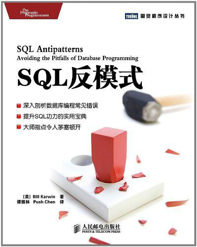

# 读《SQL反模式》

## 缘起

逛知乎偶遇阿里云数据工程师张友东的[《SQL反模式：SQL 建模与使用指南》](https://zhuanlan.zhihu.com/p/36831350)，力荐《SQL反模式》。于是，顺便也花几个小时刷了这本书。读到一半的时候，狂妄的认为自己差不多可以写一本 **《反〈SQL反模式〉》** 了，一时兴起便有了这篇读书笔记。原著中列出的反模式基本上涵盖了开发中常见的问题，虽说由于成书较早，解决方案不算尽善尽美，但即便如此也是前车之鉴，后车之师，有则改之，无则加勉，安全生产，警钟长鸣。

## 一、原著封面



## 二、乱穿马路

### 目的：存储多值属性（1NF）

一个产品可以拥有多个作者，且在数据结构设计上应该符合1NF。

### 反模式：格式化的逗号分隔列表

以下是一张不符合1NF的表格，用逗号分隔存储作者列表。由于`account_id`类型为`VARCHAR`，引发了长度不够、非作者ID、分隔符错误、查询统计困难、性能低下，等等一系列问题。

- Prodcuts

| product_id   | product_name   | account_id   |
| :----------: | :------------: | :----------: |
| 1            | blog           | 1,3          |
| 2            | crm            | 1,2,4        |

### 解决方案：创建一张交叉表

多值属性建议使用交叉表来存储，有利于CURD，避免不可信赖的用户输入。

- ProductAccounts

| product_id | account_id   |
|:----------:|:------------:|
| 1          | 1            |
| 1          | 3            |
| 2          | 1            |
| 2          | 2            |
| 2          | 4            |

### 感悟：Oracle实现分隔符转多行

逗号分隔的做法在一些非常老的系统里很常见。比如伯俊BOS2.0，或许因为存活年份实在太久，迭代需要考虑兼容性，其大量的构思、数据结构、算法简直是开发届的 **经典反面案例** 。存在的问题年代久远根深蒂固，错误的基础上已经堆积了很多高层建筑，联系千丝万缕，牵一发而动全身，一不小心就会轰然倒塌。若重构成符合规范，其代价不亚于全新重写一个，所以很多时候也只有姑息处理，一声长叹。

```sql
-- 伯俊BOS2.0采用Oracle数据库，其零售明细表
-- 一条明细用一个字段存放数量不定的导购，其分成比例也是一个字段，都采用逗号分隔
SELECT
  Z.ID,                                                                 -- 零售明细编号
  Z.TOT_AMT_ACTUAL,                                                     -- 明细成交金额
  Z.QTY,                                                                -- 明细成交数量
  REGEXP_SUBSTR(Z.SALESREPS_ID,'[^,]+', 1, L) SALESREPS_ID,             -- 多个导购编号
  NVL(REGEXP_SUBSTR(Z.SALESREPS_RATE,'[^,]+', 1, L), 1) SALESREPS_RATE, -- 多个分成比例
  L
FROM
  M_RETAILITEM Z,                                                       -- 零售明细表
  (SELECT LEVEL L FROM DUAL CONNECT BY LEVEL <= 10);                    -- 层级深度小于10
```

## 三、单纯的树

### 目的：分层存储与查询（CTE）

由于《SQL反模式》成书在2011年，且默认使用的是MySQL，当时还不支持SQL-99标准的WITH语句和CTE递归查询。作者表示，虽然使用“邻接表”数据结构没问题，但递归查询实现困难，所以采用了“路径枚举”、“嵌套集”、“闭包表”等数据结构来实现。时至今日，目前的MySQL、MariaDB和主流数据库都支持CTE递归查询了。所以，简洁有效的解决方案是“邻接表”数据结构加“SQL公用表表达式(CTE)递归实现。CTE可以解决无限分类、族谱、目录、树、公交站点等等多个经典问题。

### 反模式：总是依赖父节点

一颗总是依赖父节点的树。

```text
1、这个Bug的成因是什么（Fran）
|-- 2、我觉得是一个空指针（Ollie）
|   `-- 3、不，我查过了（Fran）
`-- 4、我们需要查无效输入（Kukla）
    |-- 5、是的，那是个问题（Ollie）
    `-- 6、好，查一下吧（Fran）
        `-- 7、解决了（Kukla）
            `-- 8、非常棒（Fran）
```

### 解决方案：邻接表 + CTE

```sql
-- 表结构
CREATE TABLE Comments (
  comment_id SERIAL PRIMARY KEY,
  parent_id BIGINT UNSIGNED,
  author VARCHAR(20),
  content VARCHAR(255)
);

-- 插入数据
INSERT INTO Comments (comment_id, parent_id, author, content) VALUES
(1, null, 'Fran', '这个Bug的成因是什么'),
(2, 1, 'Ollie', '我觉得是一个空指针'),
(3, 2, 'Fran', '不，我查过了'),
(4, 1, 'Kukla', '我们需要查无效输入'),
(5, 4, 'Ollie', '是的，那是个问题'),
(6, 4, 'Fran', '好，查一下吧'),
(7, 6, 'Kukla', '解决了'),
(8, 7, 'Fran', '非常棒');

-- 递归查找评论id为4的所有子评论
WITH RECURSIVE cte AS (
  SELECT * FROM Comments WHERE comment_id = 4    -- 条件：评论id = 4
  UNION                                          -- 递归：父评论id为此评论id的评论
  SELECT c.* FROM Comments c JOIN cte t WHERE c.parent_id = t.comment_id
)
SELECT * FROM cte;
```

### 感悟：邻接表实现与转换

- 实现：[MariaDB表达式：CTE](https://www.cnblogs.com/f-ck-need-u/p/8875863.html)
- 转换：[js-tree-list](https://github.com/yi-ge/js-tree-list)

## 四、需要ID

### 目的：建立主键规范（PK）

这一章我就不多说了，一个联合主键（联合唯一）问题上纲上线了。其实主键命名为“id”没那么恐怖，仅仅因为可以使用“USING”？

问题并不是出在id，而是出在没有联合唯一，有点牵强附会，莫须有嘛。id表示，这个锅我还真不背。

尽信书则不如无书，千万别不加思索的照搬照抄。无则加勉，有则改之吧。正如作者说的： **规则仅仅在它有帮助的时候才是好的** 。

### 反模式：以不变应万变

```sql
-- bug_id、product_id没有唯一，当然可以出现重复值啦
CREATE TABLE BugProducts (
  id            SERIAL PRIMARY KEY,
  bug_id        BIGINT UNSIGNED NOT NULL,
  product_id    BIGINT UNSIGNED NOT NULL,
  FOREIGN KEY (bug_id) REFERENCES Bugs(bug_id),
  FOREIGN KEY (product_id) REFERENCES Bugs(product_id)
);
```

### 解决方案：剪裁设计

```sql
CREATE TABLE BugProducts (
  bug_id        BIGINT UNSIGNED NOT NULL,
  product_id    BIGINT UNSIGNED NOT NULL,
  PRIMARY KEY (bug_id, product_id),                 -- 放大招，此处应有掌声
  FOREIGN KEY (bug_id) REFERENCES Bugs(bug_id),
  FOREIGN KEY (product_id) REFERENCES Bugs(product_id)
);
```

### 感悟：主键的选择与设计

- 尽量使用逻辑主键，尽量避免使用业务主键。
- 若一定要使用业务主键必须保证业务逻辑不改变。比如手机做主键，一但换号，各种逻辑必须随之改变。
- 主键不能交由用户修改，特别是业务主键。
- 除交叉表外，尽量不使用复合主键。
- 分布式需要考虑使用uuid、uuid_short、Snowflake，而不仅仅是自增主键（可参考MongoDB的ObjectId）。

## 五、不用钥匙的入口

### 目的：简化数据库架构（FK）

抛开剂量谈毒性，都是耍流氓。到底要不要用外键？不提前提条件和场景，单说啥需要或者不需要的，都是伪科学。

- 传统派需要注意，原著上的分条执行SQL的打时间差的碰瓷行为，完全属于误导。

```sql
-- 分开执行
SELECT account_id FROM Accounts WHERE account_id = 1;
INSERT INTO Bugs(reported_by) VALUES (1);
```

SQL难道不能使用子语句最大限度降低时间差的影响吗，何况还有锁行和事物机制？

```sql
-- 子语句执行
INSERT INTO Bugs(reported_by) VALUES (
  SELECT account_id FROM Accounts WHERE account_id = 1
);
```

- 反对派也别高兴太早，如果场景属于小型应用而且非常注重安全性，你以外键同步更新和删除麻烦来拒绝，也是站不住脚的。难道你不知道外键有“ **级联更新** ”吗？

### 反模式：无视约束

- 使用应用程序保证数据的完整性
- 不用外键时数据管理简单，操作方便，性能高
- 分布式部署（分库、分表），约束单纯靠数据库实现已力所难及

### 解决方案：声明约束

- 由数据库自身保证数据一致性，完整性，更可靠
- 有主外键的可以增加ER图的可读性，这点在数据库设计时非常重要
- 外键在一定程度上说明的业务逻辑，会使设计周到具体全面

### 感悟：安全 vs 性能

- 注重安全：使用外键，由数据库自身保证。适用于小型应用和注重安全的大中型应用。
- 注重性能：抛弃外键，由程序控制约束。适用于允许数据冗余和容错的大中型应用，比如互联网场景。

## 六、实体-属性-值

### 目的：支持可变属性（EAV）

完美支持弹性可变属性基本算是伪命题，实际应用中却有大量这样的需求。
究其原因，不外乎要么最初对需求分析过于粗放，没有深入到细节，很多本需弹性的需求却被固化了，到发现时为时已晚。

### 反模式：使用泛型属性表

将EAV（实体-属性-值：类似于NoSQL的Key-Value）结构用在了关系型数据库。问题如下：

- 数据未定义类型，通常是字符类型的，通常需要转换后才能对比
- 不可靠的用户输入导致录入格式无法保证，因此数据无法转换
- 无法保证取值被正确约束，比如状态（Status）值超过规定范围
- Key（attr_name）命名不一致，一义多名，导致问题

```sql
CREATE TABLE IssueAttributes (
  issue_id    BIGINT UNSIGNED NOT NULL,
  attr_name   VARCHAR(100) NOT NULL,
  attr_value  VARCHAR(100),
  PRIMARY KEY (issue_id, attr_name),
  FOREIGN KEY (issue_id) REFERENCES Issues(issue_id)
);
```

### 解决方案：模型化子类型

- 单表继承：多一个属性，就多创建一列呗，用不到的就空着。
- 实体表继承：公共的属性拎出来一张主表，不常用的属性加上公共属性另外搞一张表，另类的属性加公共属性再搞一张表，外键关联起来。
- 类表继承：公共的属性拎出来一张主表，不常用的属性每一个属性搞一张表存着，外键关联起来。
- 半结构化数据模型：把不常用属性存成JSON或者XML。（吐槽：真是美其名曰了，我想知道跟逗号有什么区别？难道存逗号就不是半结构化，存JSON就高大上了？）

### 感悟：以不变应万变

可变属性基本算是一个伪命题，由于属性不确定性，每个属性搞一个字段是能解决数据类型问题，但是你确定要这样做？
一张表一百个字段，用到的就几个，其他全空值？新来一属性，就让DBA`ALTER TABLE ADD COLUMN`一次？然后招呼程序员改代码？
不是所有人都是DBA，也不是所有人都是程序员，普通的系统管理用户可能连基本的编程代码都不会，怎么办？
个人认为，对付“千变万化”的指导思想是， **存储结构不变** ，数据爱怎么变怎么变，随他变。

1. 使用Key-Value，分段存储，动态弹性存储属性，灵活性设计方案；
2. 使用JSON（MySQL的字段已经全面支持JSON类型）或XML半结构化存储，整段存取，也算是Key-Value的变种；
3. 使用特性表`Features`扩张，不同产品拥有多个特性表（前端表现为多个Tab页），按需迭代，对既有设计的影响尽量做到最小。

```sql
-- 特性
CREATE TABLE Features(
  feature_id SERIAL PRIMARY KEY,
  name       VARCHAR(255) UNIQUE NOT NULL,
  comment    VARCHAR(255) NULL
);
-- 产品特性
CREATE TABLE ProductFeatures (
  product_id  BIGINT UNSIGNED NOT NULL,
  feature_id  BIGINT UNSIGNED NOT NULL,
  PRIMARY KEY (product_id, feature_id),
  FOREIGN KEY (product_id) REFERENCES Products(product_id),
  FOREIGN KEY (feature_id) REFERENCES Features(feature_id)
);
-- 当表名是变量，可采用存储过程实现，甚至可以使用循环
SET @sql = concat(
    'SELECT * FROM ',
    (SELECT name FROM features WHERE feature_id = 1)
);
PREPARE stmt FROM @sql;
EXECUTE stmt;
```

## 七、多态关联

### 目的：引用多个父表（1NF）

Comments（评论表）可能被Bugs（错误表）和特性表（Features）同时用到。
其实原著中有一句话我非常赞同： **当你看清楚问题的根源时，解决方案将变得异常简单：多态关联是一个反向关联。**

### 反模式：使用双用途外键

Comments里面多了个type字段说明是评论来自Bugs还是来自Features的。就像一个孩子有两个父亲。

- Bugs

| bug_id | product_id |           name           |
|--------|------------|--------------------------|
|      1 |          1 | 产品拥有多个作者         |
|      2 |          1 | 评论需要分层             |
|      3 |          2 | 根据关键字统计引用量出错 |

- Features

| feature_id | product_id |      name      |
|------------|------------|----------------|
|          1 |          1 | 完美支持多作者 |
|          2 |          1 | 树形多层评论   |
|          3 |          2 | 支持关键字统计 |

- Comments

| comment_id | issue_type | issue_id | comment  |
|------------|------------|----------|----------|
|          1 | bug        |        1 | bug 1    |
|          2 | feature    |        1 | feture 1 |
|          3 | bug        |        2 | bug 2    |

### 解决方案：让关系变得简单

使用交叉表。

- Bugs（同上）
- Featrues（同上）
- Commnets（变为基础表，不再关联其他表）

| comment_id | parent_id |  commnet  |
|------------|-----------|-----------|
|          1 | null      | bug 1     |
|          2 | null      | feature 1 |
|          3 | 1         | re bug 1  |

- BugsComments（交叉表）

| bug_id | comment_id |
|--------|------------|
|      1 |          1 |

- FeatruesComments（交叉表）

| feature_id | comment_id |
|------------|------------|
|          1 |          2 |

### 感悟：投胎很重要，看清楚谁是你爸！

说白了，就是一个父亲有两亲生孩子正常，一孩子有两个亲生父亲？要不要打听一下隔壁是不是姓王？
所以，评论表才是父亲，错误评论和特性评论表才是孩子。可怜的娃，认子作父！

同样的，我见过很多设计，在规划附件表（Attachments）的时候犯同样的错误，总以为附件从属于文章（插图等），附件从属于产品（说明书等），附件从属于门店（照片等）。
重度耦合，导致同一份文件副本被存储多次，文件存储系统管理混乱，臃肿不堪，无法去重。说实话，别再认贼作父了，附件才是真正的老子。

## 八、多列属性

### 目的：存储多值属性（又是1NF）

给Bugs打标签，一个Bugs有多个标签。

### 反模式：创建多个列

创建多个tag列，你能确保一个Bugs最多只能有三个标签？假如最多有100个，tag100？

- Bugs

| bug_id | description  |   tag1   |     tag2    | tag3 |
|--------|--------------|----------|-------------|------|
|      1 | 保存时崩溃   | crash    | null        | null |
|      2 | 打印输出缓慢 | printing | preformance | null |
|      3 | 需要支持XML  | null     | null        | null |

### 解决方案：创建从属表

- Bugs

| bug_id | description  |
|--------|--------------|
|      1 | 保存时崩溃   |
|      2 | 打印输出缓慢 |
|      3 | 需要支持XML  |

- Tags

| tag_id |     name    |
|--------|-------------|
|      1 | crash       |
|      2 | printing    |
|      3 | preformance |

- BugsTags

| bug_id | tag_id |
|--------|--------|
|      1 |      1 |
|      2 |      2 |
|      2 |      3 |

### 感悟：如此穷追不舍，1NF表示受够了！

1NF这个问题又拿出来讲，作者真有点过分了，说逗号分隔是“乱穿马路”我忍了，然后又来了，把逗号改成多列，每列命名一下，说是“多列属性”，又拿来炒！这个真不能忍！

## 九、元数据分裂

### 支持可扩展性（PARTITION）

数量极为庞大的时候，考虑到空间和性能，需要进行分表操作。但如果手动分表，由于没有自动化的系统逻辑联系，会造成数据唯一性、完整性、同步性、跨表查询等各种问题，以及创建新表，迁移业务导致业务暂停的问题。自动化、标准化的分表请参考数据表分区技术`PARTITION`。

### 反模式：克隆表与克隆列

```sql
CREATE TABLE Bugs_2007(bug_id SERIAL PRIMARY KEY, date_reported DATE /* other columns*/);
CREATE TABLE Bugs_2008(bug_id SERIAL PRIMARY KEY, date_reported DATE /* other columns*/);
CREATE TABLE Bugs_2009(bug_id SERIAL PRIMARY KEY, date_reported DATE /* other columns*/);
```

### 解决方案：分区及标准化

```sql
CREATE TABLE Bugs (
  bug_id SERIAL PRIMARY KEY,
  date_reported DATE
  -- other columns
) PARTTION BY HASH (YEAR(date_reported)) PARTTIONS 4;
```

### 感悟：前车之鉴，后车之师

很多方案其实都是现成的，学会借鉴很重要。康庄大道通罗马，可惜有人偏偏钻进了死胡同。

## 十、取整错误

### 目的：使用小数取代整数（DECIMAL)

`IEEE 754`的浮点数精度问题会导致计算结果偏差。很多数据库引擎的`FLOAT`类型就是一个非精确值。

### 反模式：使用FLOAT类型

```sql
-- 字段该加在哪张表？时薪难道常年不变？我就不吐槽了。
ALTER TABLE Bugs ADD COLUMN hour FLOAT;
ALTER TABLE Accounts ADD COLUMN hour_rate FLOAT;
```

### 解决方案：使用DECIMAL类型

```sql
ALTER TABLE Bugs ADD COLUMN hour DECIMAL(9, 2);
ALTER TABLE Accounts ADD COLUMN hour_rate DECIMAL(9, 2);
```

### 感悟：FLOAT不可靠，地球人都知道

其实也算是非数据库程序员经常会犯的错误，很多程序设计语言并没有`DECIMAL`类型，高精度计算需要用到数学库。
比如`JavaScript`只有`number`类型，高精度计算需要用到[math.js](http://mathjs.org)。

## 十一、每日新花样

### 目的：限定列的有效值（ENUM）

Status（状态）取值必须有效。但是，Status取值却不是固定的，有可能会添加Status的值。

### 反模式：在列定义上指定可选值

使用`CHECK`或者`ENUM`定义在列上，当要动态添加取值的时候，会导致要求DBA去修改数据结构。

```sql
CREATE TABLE Bugs (
  -- other columns
  status ENUM('NEW', 'IN PROGRESS', 'FIXED')
);
```

### 解决方案：在数据中指定值

- BugsStatus

```sql
CREATE TABLE BugsStatus (
  status VARCHAR(20) PRIMARY KEY
);
INSERT INTO BugsStatus (status) VALUES
('NEW'), ('IN PROGRESS', ('FIXED');
```

- Bugs

```sql
CREATE TABLE Bugs(
  -- other columns
  status VARCHAR(20),
  FOREIGN KEY (status) REFERENCES BugsStauts(status)
    ON UPDATE CASCADE
);
```

### 感悟：慎用ENUM（枚举类型）

大多数SQL引擎并不支持枚举类型，除非固化不动，尽量慎用。增删改的时候需要专业人员使用DDL（数据库定义语言），而不是普通用户可以使用的DML（数据操纵语言）。

## 十二、幽灵文件

### 目标：存储图片或其他多媒体大文件（BLOB）

这个问题见仁见智了，其实大量的做法是用`VARCHAR`存储文件路径，原著推荐使用`BLOB`二进制格式存储到数据库。你认为那种正确？我能告诉你都错了吗？

### 反模式：假设你必须使用文件系统（也就是存储文件路径啦）

```sql
CREATE TABLE Screenshots(
  bug_id            BIGINT UNSIGNED NOT NULL,
  image_id          BIGINT UNSIGNED NOT NULL,
  screenshot_path   VARCHAR(100),
  caption           VARCHAR(100),
  PRIMARY KEY (bug_id, image_id),
  FOREIGN KEY (bug_id) REFERENCES Bugs(bug_id)
);
```

原著列举了几大罪状：

- 文件不支持DELETE
- 文件不支持事物隔离
- 文件不支持回滚操作
- 文件不支持数据库备份工具
- 文件不支持SQL的访问权限设置
- 文件不是SQL数据类型

### 解决方案：在需要时使用BLOB类型

```sql
CREATE TABLE Screenshots(
  bug_id            BIGINT UNSIGNED NOT NULL,
  image_id          BIGINT UNSIGNED NOT NULL,
  screenshot_path   BLOB,
  caption           VARCHAR(100),
  PRIMARY KEY (bug_id, image_id),
  FOREIGN KEY (bug_id) REFERENCES Bugs(bug_id)
);
```

其实反模式里面的罪状都可以用程序控制的办法解决。
时至今日，静态内容使用分层存储更有甚者使用对象存储，是时候考虑一下问题了：

- 文件如何去重，特别是大文件？
- 流媒体文件如何在线播放？
- 动辄5G、10G的文件也要存BOLB吗？
- 不同的bug引用了同一份文件副本，有几份存几份BLOB么？
- 为了快速加载，要支持CDN，如何操作？
- 如何迁移到云存储？
  - [Amazon S3](https://aws.amazon.com)
  - [阿里云OSS](https://www.aliyun.com/product/oss)
  - [腾讯COS](https://cloud.tencent.com/product/cos)
  - [七牛云](https://www.qiniu.com)
  - [Firebase](https://www.firebase.com)
- 如何支持私有云？
  - [Ceph](https://ceph.com)
  - [SeaFile](https://www.seafile.com)

### 感悟：我说都错了，你信吗？

1. 文件存储逐步从传统文件系统迁移到了对象存储服务。还在用BLOB存入数据库？就在记忆里画一个叉吧。
2. 原著在数据结构设计上欠妥，主次关系混乱了。正如我在[多态关联](#六、多态关联)中提到的，文件其实属于基类。以下为建议数据结构：

```sql
CREATE TABLE files (
  id          CHAR(32) PRIMARY KEY,       -- 文件HASH，文件名，一般是MD5
  mime        VARCHAR(255) NOT NULL,      -- 文件MIME，可计算为文件扩展名
  size        BIGINT UNSIGNED NOT NULL    -- 文件大小
  -- 无path？因为有buckets表和file_buckets表，二者结合解决存放位置问题
);
```

```sql
CREATE TABLE BugFiles (
  bug_id  BIGINT UNSIGNED NOT NULL,
  file_id BIGINT UNSIGNED NOT NULL,
  PRIMARY KEY (bug_id, file_id),
  FOREIGN KEY (bug_id) REFERENCES Bugs(bug_id),
  FOREIGN KEY (file_id) REFERENCES files(id)
);
```

## 十三、乱用索引

### 目标：优化性能（INDEX)

改善性能最好的技术就是在数据库中合理的使用索引。

### 反模式：无规划的使用索引

- 无索引或者索引不足：导致历遍全表
- 使用了太多的索引或者使用了一些无效索引：导致不必要的额外开销
- 执行一些让索引无能为力的查询：根本没有用到索引

### 解决方案：MENTOR你的索引

- Measure（测量）：查看“慢查询”日志
- Explain（解释）：查询执行计划（QEP）
- Nominate（挑选）：查询分析器
- Test（测试）：把找出来的问题做相应测试
- Optimize（优化）：优化索引性能
- Rebuild（重建）：重建索引

### 感悟：合理利用数据查询分析工具

没有索引翻箱倒柜，索引太多打草惊蛇。过犹不及，有和没有都会引起不必要的内耗，导致性能问题，合理的安排索引非常重要。

## 十四、对未知的恐惧

### 目标：辨别悬空值（NULL)

获取全名的时候，将中间名的列声明成了`NULL`，导致中间名为`NULL`的全名也成了`NULL`。

```sql
SELECT CONCAT(first_name, middle_initial, last_name) FROM Accounts;
-- output: NULL
```

### 反模式：将NULL作为普通的值，反之亦然

- 将所有列一律声明为`NOT NULL`
- 列中的每一个值都必须存在且有意义的时候，却用了`NULL`

### 解决方案：将NULL视为特殊值

值必须存在且有意义的时候，请务必声明为`NOT NULL`，可结合`DEFAULT`赋予默认值。

### 感悟：NULL or NOT NULL，that is the question

- 传统程序员：`true`、`false`
- 数据库程序员：`true`、`false`、`null`
- JavaScript程序员：`true`、`false`、`null`、`undefined`、`NaN`、`Infinity`、……

## 十五、模棱两可的分组

### 目标：获取每组的最大值（GROUP BY）

使用 `GROUP BY` 获取正确的数据。

- Bugs

|     product_name    | date_reported  |  bug_id  |
|---------------------|----------------|----------|
| Open RoundFile      | 2009-12-19     | ~~1234~~ |
| Open RoundFile      | ~~2010-06-01~~ | 2248     |
| Visual TurboBuilder | 2010-02-16     | 3456     |
| Visual TurboBuilder | 2010-02-10     | 4077     |
| Visual TurboBuilder | 2010-02-16     | 5150     |
| ReConsider          | 2010-01-01     | 5678     |
| ReConsider          | 2009-11-09     | 8063     |

### 反模式：引用非分组列

```sql
SELECT product_name, max(date_reported) AS latest, bug_id
FROM bugs GROUP BY product_name ORDER BY bug_id;
```

结果如下：

|     product_name    | date_reported  |  bug_id  |
|---------------------|----------------|----------|
| Open RoundFile      | ~~2010-06-01~~ | ~~1234~~ |
| Visual TurboBuilder | 2010-02-16     | 3456     |
| ReConsider          | 2010-01-01     | 5678     |

- 请注意第一行的`date_reported`与`bug_id`并不匹配，已用删除线标记
- Visual TurboBuilder 其实有两行数据都是 2010-02-16 的

### 解决方法：无歧义的使用列

原著给出的方案，我粗略看了一些，依然是问题重重：

- 只查询功能依赖的列product_name, max(date_reported)：我就要对应bug_id怎么办？
- 使用关联子查询：给出了相当复杂的SQL，有效性有待验证
- 使用衍生表：给出了相当复杂的SQL，有效性有待验证
- 使用JOIN：给出了相当复杂的SQL，有效性有待验证
- 对额外列使用聚合函数MAX(bug_id)：万一bug_id并不MAX呢？
- 连同组所有值，用`GROPU_CONCAT`连接成bug_id_list：说好的我只要对应的bug_id你给我一堆？

### 感悟：思维务必要清晰

其实没那么复杂，使用聚合函数时思维务必要清晰，父子主次分清楚，否则一片混沌。上列解法如下，简单吧？

```sql
SELECT product_name, date_reported, bug_id FROM bugs
WHERE date_reported IN (SELECT max(date_reported) FROM bugs b GROUP BY product_name)
ORDER BY date_reported DESC;
```

## 十六、随机选择

### 目标：获取样本记录（RAND）

从大量记录中获取一条随机记录。

### 反模式：随机排序

著名的将`RAND()`放`ORDER BY`，历遍全表加重复扫描，性能不出问题才怪。

```sql
SELECT * FROM Bugs ORDER BY RAND() LIMIT 1;
```

### 解决方案：没有具体的顺序

原著中给了很多方法，性能倒是改善了。我也不多做评价了，一句话，有必要搞这么复杂吗？

### 感悟：简单点不好吗？

```sql
SELECT * FROM Bugs
WHERE bug_id >= (SELECT FLOOR(RAND() * (SELECT MAX(bug_id) FROM Bugs)))
ORDER BY bug_id LIMIT 1;
```

## 十七、可怜人的搜索引擎

### 目标：全文搜索（FULLTEXT）

通过关键字搜索字符串，通过字符串搜索全文。

### 反模式：模式匹配断言

使用`LIKE`性能和效率都非常的低，大量数据全文检索的情况下速度实在令人无法接受。

```sql
SELECT * FROM Bugs WHERE description LIKE '%crash';
```

### 解决方案：使用正确的工具

- 添加全文索引：FULLTEXT（MySQL5.7开始支持ngram自然语言分词）
- 第三方搜索引擎：Apache Lucene、Sphinx Search（估计可以进博物馆了）

```ini
# my.cnf
[mysqld]
ngram_token_size=2
```

```sql
CREATE TABLE Bugs (
  bug_id        SERIAL PRIMARY KEY,
  description    TEXT,
  -- other columns,
  FULLTEXT(description) WITH PARSER ngram
);
SELECT * FROM bugs
WHERE MATCH (description) AGAINST ('计算机');
```

### 感悟：中文全文检索

从MySQL 5.7开始，MySQL内置了， **ngram全文检索插件** 支持中文分词，并且对MyISAM和InnoDB引擎有效。
但实际应用上还是有或多或少的问题，比如著名的“杭州市长春药店”问题。

- [MySQL 8.0 安装踩坑指南](https://juejin.im/entry/5adb5deff265da0b9d77cb3b)
- [ngram全文检索插件](https://dev.mysql.com/doc/refman/5.7/en/fulltext-search-ngram.html)

## 十八、意大利面条式查询

### 目标：减少SQL查询数量（SQL）

如何正确、简单、高效完成复杂的SQL查询。

### 反模式：使用一步操作解决复杂问题

SQL开发人员常常仅用一句SQL查询完成一个复杂问题。

### 解决方案：分而治之

尽管SQL支持用一行代码解决复杂问题，但也别做不切实际的事情。

### 感悟：大道至简，把复杂变简单其实没那么简单

常用的复杂的SQL查询，其实可以创建视图（VIEW）。

## 十九、隐式的列

### 目标：减少输入（*)

描述为“获取正确的列”更妥当。

### 反模式：捷径会让你迷失方向

在非调试模式使用`*`，会带来很多的问题，比如列名覆盖、系统开销、安全隐患等等。

```sql
-- a.title = 书的标题、b.title = 作者的称呼
-- 应用程序的 res.title = b.title，得不到正确的标题
SELECT * FROM Books a JOIN Authors b ON a.author_id = b.author_id;
```

### 解决方案：明确列出列名

```sql
SELECT a.title, b.name, b.title author_title
FROM Books a
JOIN Authors b ON b.author_id = a.author_id;
```

### 感悟：`*`是把双刃剑

开发调试的时候可以快速排查，但非调试模式下尽量少用。

## 二十、明文密码

### 目标：恢复或重置密码（HASH）

密码可以重置，但永远不能被提供或破解。

### 反模式：使用明文存储密码

明文存储密码！居然还真有人这么干了！

### 解决方案：先哈希，后存储

哈希安全字串加密码。

### 感悟：天王盖地虎，宝塔镇河妖！

- 蛮荒时代：明文，赤裸裸的明文。CSDN，你出来解释一下！
- 封建王朝：`MD5`一下完事。这就完了？不知道MD5可以爆破吗？已知MD求明文，社工库笑了。
- 现代社会：前端哈希`password`送出，后端加点盐再哈希一下，后端读取的跟前端送出的不要一致。

## 二十一、SQL注入

### 目标：编写SQL动态查询（Injection）

防范应用程序变量插入SQL查询中带来的安全问题。

### 反模式：将未经验证的输入作为代码执行

```php
<?php
$bug_id = $_REQUEST['bug_id'];     // 输入：1234; DELETE FROM Bugs;
$pdo->query("SELECT * FROM Bugs WHERE bug_id = $bug_id");
```

### 解决方案：不信任任何人

原著中就事论事的给出了解决方案，其实很多并不能解决注入问题：

- 过滤输入内容：转换为数字
- 参数化动态内容：使用SQL参数
- 给动态输入的值加引号：数字变成字符串
- 将用户与代码隔离：不直接使用输入全局变量
- 找个可靠的人来帮你审查代码：出门靠朋友？

### 感悟：道高一尺魔高一丈

- 转义字符伪装注入更可怕，`\`、`--`、`/* */`都能被注入！
- 善用语言、扩展、模块自带的防注入工具
  - PHP：`mysql_real_escape_string()`、`stripslashes()`、`magic_quotes_gpc()`
  - node-mysql：`escape()`、`escapeId()`、`format()`
- 可接合SQL占位符拼接SQL语句
- 提高防范意识，多检查，多测试

## 二十二、伪键洁癖

### 目标：整理数据（GUID）

使数据编号连续。

### 反模式：填充角落

随着数据库的使用，有些行会被删除。比如原来连续编号的1234，3被删除了，变成124。
强迫症患者新增记录的时候会找出缺失的3，然后把新记录填充进去，编号为3。
或者当编号3被删除时强制把编号4更新为编号3。由于编号已被各种关联，引起一堆问题。

### 解决方案：克服心理障碍

- 使用`ROW_NUMBER()`定义行号
- 使用`GUID`

### 感悟：我觉得可以抢救一下

早发现，早治疗，正确面对，主动配合，还你健康人生。
杭州七院24小时心理援助热线：`0571-85029595`。

## 二十三、非礼勿视

### 目标：写更少的代码（Debug）

用更少的代码来提高代码的优雅程度？我怎么觉得是：如何正确展现错误并快速的排除错误呢？

### 反模式：无米之炊

- 用户界面没有错误提示，用户一脸茫然
- 难以被发现的代码错误，码农一脸懵逼

### 解决方案：优雅的从错误中恢复

- 使用捕捉机制`try...catch...`
- 利用日志机制调试

### 感悟：排错是基本功

出错了，要给用户必要的明确的提示，给码农完整的详尽的提示。

## 二十四、外交豁免权

### 目标：采用最佳实践（Project Management）

- 版本控制
- 自动化测试
- 文档

### 反模式：将SQL视为二等公民

数据开发工作未被软件工程最佳实践纳入。

### 解决方案：建立一个质量至上的文化

将数据库设计开发工作纳入软件工程管理范畴，并提供最佳实践。

### 感悟：数据为王

- 谁敢说SQL是二等公民？马爸爸说了，接下是DT（Data Technology）时代。
- 软件工程最佳实践又何止版本、测试、文档三方面。

## 二十五、魔豆

### 目标：简化MVC模型（Design pattern）

低耦合、高内聚。清晰的领会模型的意义。

### 反模式：模型仅仅是活动记录

一个领域模型（Model）对应一个数据库表（Table），导致大量代码别复制粘贴，而不能很好的被复用。高耦合，低内聚，业务逻辑混乱。
其实这是对`Active Record`理解的问题，也属于设计模式问题，一个领域模型对应一个具体表还一个业务逻辑模型的问题。

### 解决方案：模型包含活动记录

原著推荐《领域驱动设计：软件核心复杂性应对之道》，模型设计围绕程序逻辑，而不是数据库层面，将模型和表解耦，业务逻辑与实体表分层。

### 感悟：运用之道，存乎一心

深入理解设计模式，并将它正确的运用在开发过程中。

## 总结

- **思维方式** ： SQL语法是基础是手段，思维方式是指导思想，如果思维误入歧途，再好的手段也只能是南辕北辙；
- **数据结构** ：虽然原著对“多态关联”和“可变属性”等数据结构做了阐述并解决，但有意无意中也在犯着同样的错误，透彻的分析并理解数据结构非常重要；
- **第一范式** ：原著对于第一范式（1NF）的理解还是比较透彻的，大约用了三章阐述类似的问题，略啰嗦；
- **下划线命名法** ：原著中采用驼峰命名法，其实在大多数数据库系统中大小写不敏感，ProductBugs和PRODUCTBUGS并没有什么区别，所以建议命名为：product_bugs；
- **约定大于配置** ：原著中所有的ID，都使用了“表名（单数）_id”，并不符合“约定大于配置”的现代开发理念。主表ID还是建议用id，引用表外键建议用“主表（单数）_id”；
- **分布式分层部署** ：原著中的实践环境并没有考虑到分布式及分层式部署，特别是`BLOB`格式存储文件，这样的设计相对已经很落后了，请大家借鉴着阅读，以防踩坑。

## 声明

- 版权所有，未经作者同意不得用于商业用途。
- 欢迎转载，敬请保留作者信息。

> 方跃明
> 2018-05-31
