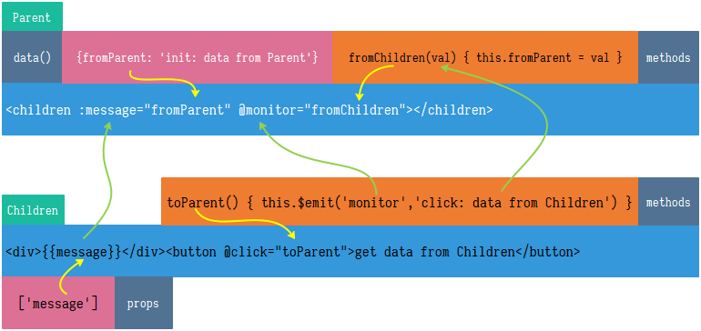

# Vue 父子组件通信

## 理解

- `component`：相当于一个函数，`props => { return event => $emit }`
- `props`：相当于传统意义上类的`public`属性，但此属性不能被自身初始化
- `data`：相当于传统意义上类的`private`属性，此属性必须被自身初始化
- `$emit('event')`：里的`event`相当于传统意义上类的`callback`回调
- `methods`: 里的方法相当于传统意义上类的`private`方法
- `mounted()`：相当于传统意义上类的构造函数

## 官方文档

- [props](https://cn.vuejs.org/v2/guide/components-props.html)
- [.sync](https://cn.vuejs.org/v2/guide/components-custom-events.html#sync-%E4%BF%AE%E9%A5%B0%E7%AC%A6)

## 分析

- 子组件
  - 定义`props`，父组件调用子组件时，父组件可直接改变绑定的`props`值
  - 通过`this.$emit('event', val)`传递事件（`event`）和值（`val`）到父组件
- 父组件
  - 调用子组件，其中`props`值的变化，直接被传递到子组件
  - 子组件若要将`props`的值传给父组件，需要通过`emit`发射事件和值到父组件



## 示例

```vue
<!-- Children.vue -->
<template>
  <div id="children">
    <h3>Children</h3>
    <button @click="toParent">get data from Children</button>
    <div>{{message}}</div>
  </div>
</template>

<script>
export default {
  name: 'Children',
  props: ['message'],
  data() {
    return {

    }
  },
  methods: {
    toParent() {
      this.$emit('monitor','click: data from Children');
    }
  }
}
</script>
```

```vue
<!-- Parent.vue -->
<template>
  <div id="parent">
    <h3>Parent</h3>
    <children :message="fromParent" @monitor="fromChildren"></children>
  </div>
</template>

<script>
import Children from './Children'
export default {
  name: 'Parent',
  components: {
    Children
  },
  data() {
    return {
      fromParent: 'init: data from Parent'
    }
  },
  methods: {
    fromChildren(val) {
      this.fromParent = val
    }
  }
}
</script>
```
