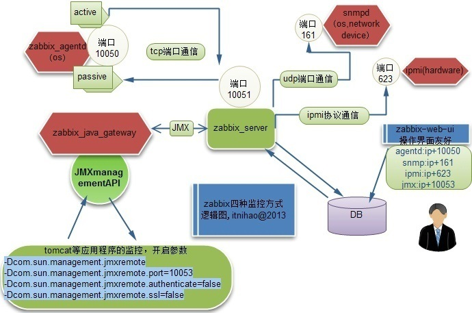

# Zabbix安装笔记

> 方跃明 2011-11-11

Zabbix（[`zæbiks]）是一个基于WEB界面的提供分布式系统监视以及网络监视功能的企业级的开源解决方案。

详细安装步骤参见：[官方安装手册]

## Zabbix Server



### 安装数据库

```shell
# 安装 MariaDB 服务器和客户端
yum install mariadb-server mariadb
systemctl start mariadb
mysql -uroot -ppassword    # 进入MySQL命令行
```

```sql
-- MariaDB新建zabbix用户
UPDATE user SET password=PASSWORD('zabbix') WHERE user='zabbix';
CREATE DATABASE IF NOT EXISTS zabbix DEFAULT CHARACTER SET utf8 COLLATE utf8_general_ci;
FLUSH PRIVILEGES;
QUIT
```

### 安装服务端

```shell
rpm -ivh http://repo.zabbix.com/zabbix/3.0/rhel/7/x86_64/zabbix-release-3.0-1.el7.noarch.rpm
yum install zabbix-server-mysql zabbix-web-mysql
cd /usr/share/doc/zabbix-server-mysql-3.0.3
zcat create.sql.gz | mysql -uzabbix -pzabbix zabbix
```

### 修改服务器配置

```ini
## vi /etc/zabbix/zabbix_server.conf
DBHost=localhost
DBName=zabbix
DBUser=zabbix
DBPassword=zabbix
```

### 修改WEB服务器配置文件

```ini
## vi /etc/httpd/conf.d/zabbix.conf
php_value data.timezone Asia/Shanghai
```

### 启动Zabbix服务器和WEB服务器

```shell
systemctl start zabbix-server
systemctl start httpd
```

## Zabbix Agent


### CentOS

#### 安装

```shell
yum install zabbix-agent
```

#### 配置

```ini
# vi /etc/zabbix/zabbix_agent.conf
LogFile=/var/log/zabbix/zabbix_agentd.log   # 日志
Server=127.0.0.1                            # Zabbix Server（直接连接）或者Zabbix Proxy（通过Proxy）
Hostname=Zabbix Server                      # 对应zabbix web里面的host，不一定是os本机名称
ServerActive=127.0.0.1                      # Zabbix Server或Zabbix Proxy
```

#### 配置防火墙，打开Zabbix Agent端口（默认入站端口10050）

```shell
systemctl start zabbix-agent
```

### Windows

#### 下载并解压到运行目录

[Zabbix pre-compiled agents for Windows](http://www.zabbix.com/download.php)

#### 配置conf(conf\zabbix-agentd.win.conf)

```ini
LogFile=c:\zabbix_agentd.log  # 日志
Server=127.0.0.1              # Zabbix服务器
Hostname=Windows Host         # 对应zabbix web里面的host，不一定是本机名称
ServerActive=127.0.0.1        # Zabbix服务器
```

- 注册为Windows服务：`bin\zabbix_agentd.exe -c \conf\zabbix_agentd.win.conf –i`
- 打开Zabbix Agent端口（默认入站端口10050）
- 从Windows服务启动Zabbix Agent客户端

## Zabbix Proxy

### 安装服务器

```shell
rpm -ivh http://repo.zabbix.com/zabbix/3.0/rhel/7/x86_64/zabbix-release-3.0-1.el7.noarch.rpm
yum install mariadb-server mariadb zabbix-proxy-mysql
systemctl start mariadb
mysql                       # 进入MySQL命令行
```

### 分配帐号、授权及建立数据库

```sql
UPDATE user SET password=PASSWORD('zabbix') WHERE user='zabbix';
FLUSH PRIVILEGES;
CREATE DATABASE IF NOT EXISTS zabbix_proxy DEFAULT CHARACTER SET utf8 COLLATE utf8_general_ci;
QUIT
```

### 导入数据库

```shell
# cd /usr/share/doc/zabbix-proxy-mysql-3.0.3
zcat schema.sql.gz | mysql -uzabbix -pzabbix zabbix_proxy
```

### 修改服务器配置文件

```ini
# vi /etc/zabbix/zabbix_proxy.conf
Server=zabbix.server.url      # Zabbix Server 所在IP或者DNS Name
Hostname=proxy.zabbix.name    # Zabbix Proxy 名字（对应Server里的Proxies名字）
DBHost=localhost
DBName=zabbix_proxy
DBUser=zabbix
DBPassword=zabbix
```

### 打开Zabbix Agent端口（默认入站端口10050）

### 启动Zabbix服务器

```shell
systemctl start zabbix-proxy
```

### Zabbix Server Web 对应的设置

- 添加代理：Administration -> Proxies -> Create proxy -> Proxy name -> proxy.zabbix.name
- 添加代理下的主机：Configuration -> Hosts -> Create Host -> Monitored by proxy -> proxy.zabbix.name

### 注意事项

- Proxy只能使用proxy的数据库，不能使用Server的数据库
- 注意Server端和Proxy端的IP/DNS名称、配置主机名称、Web端名称、各选项正确且一一对应

## Zabbix SNMP

- Windows Server 2008 R2
  - 客户机端安装：SNMP Service
  - 客户机端设置：服务 -> SNMP Service -> 安全 -> 接受的社区名称：public，只读 -> 添加接受主机：Zabbix服务器
  - 客户机端防火墙：入站规则 -> 默认端口161 -> 协议UDP
  - Zabbix Web端添加SNMP主机及端口号

- CentOS
  - 安装：`yum install net-snmp net-snmp-utils`
  - 参见：<https://blog.csdn.net/sinat_21302587/article/details/75099915>

[官方安装手册]: https://www.zabbix.com/documentation/3.0/manual/installation/install_from_packages
